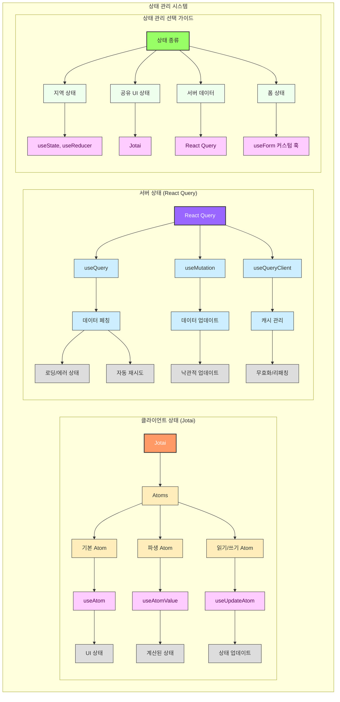
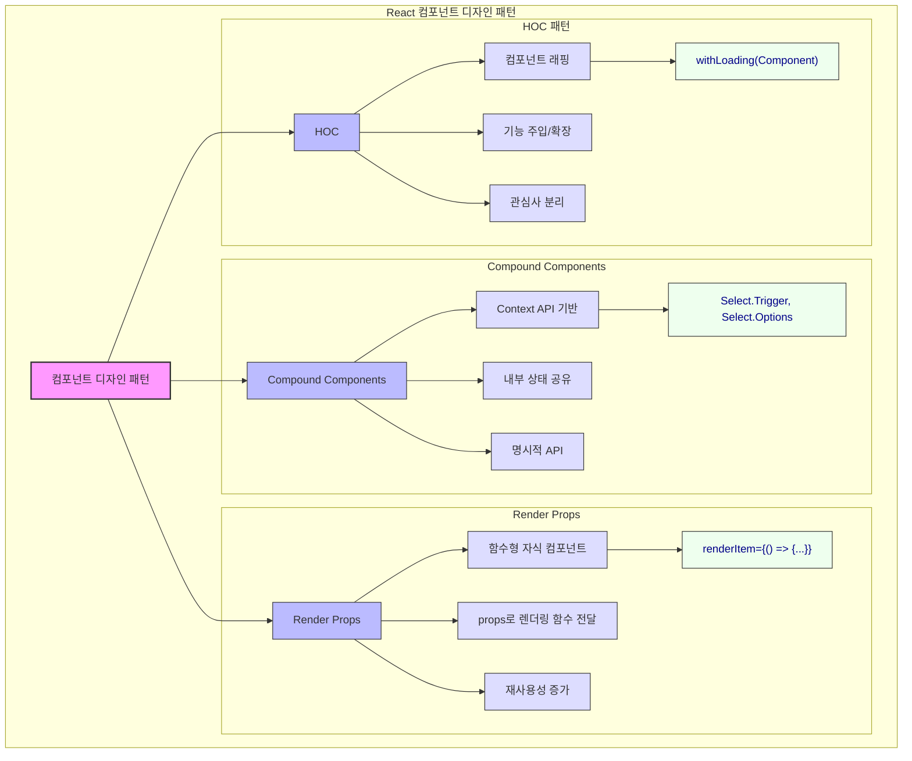
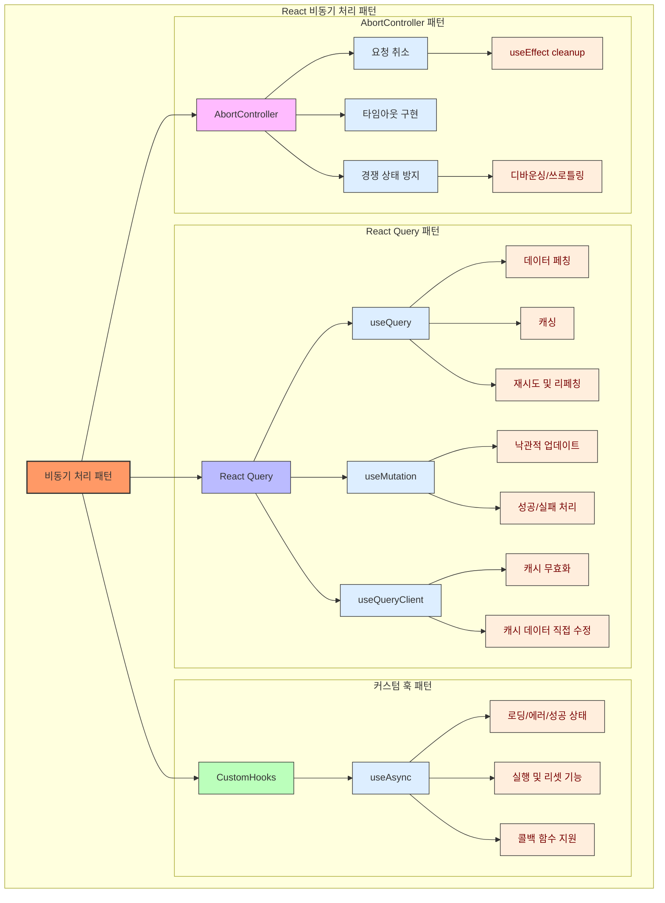
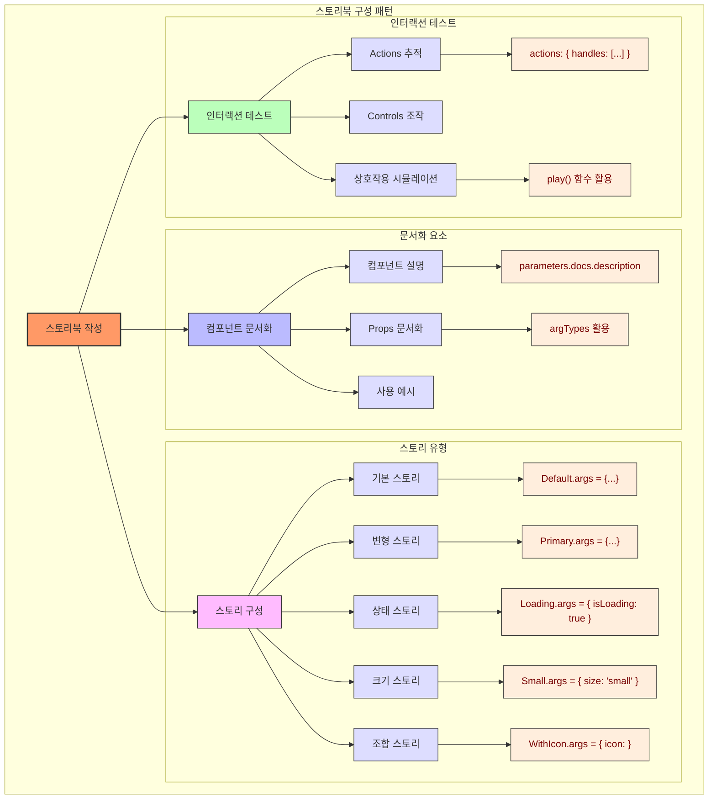
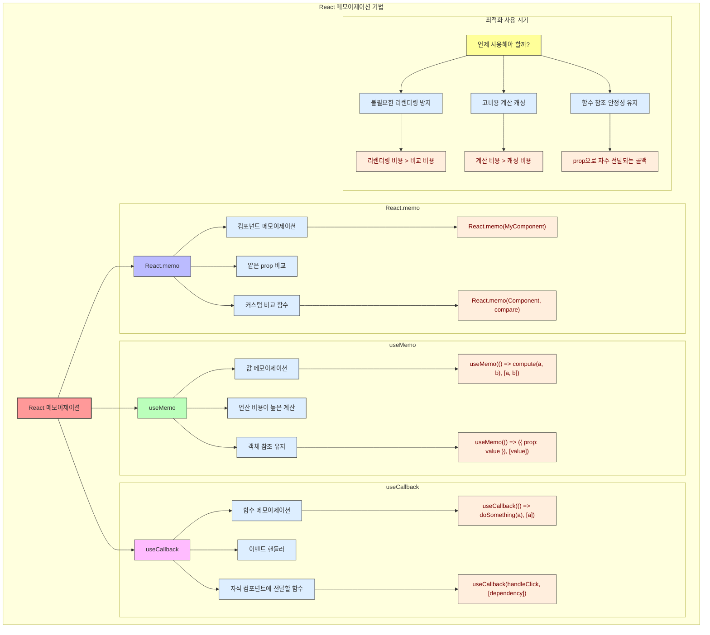
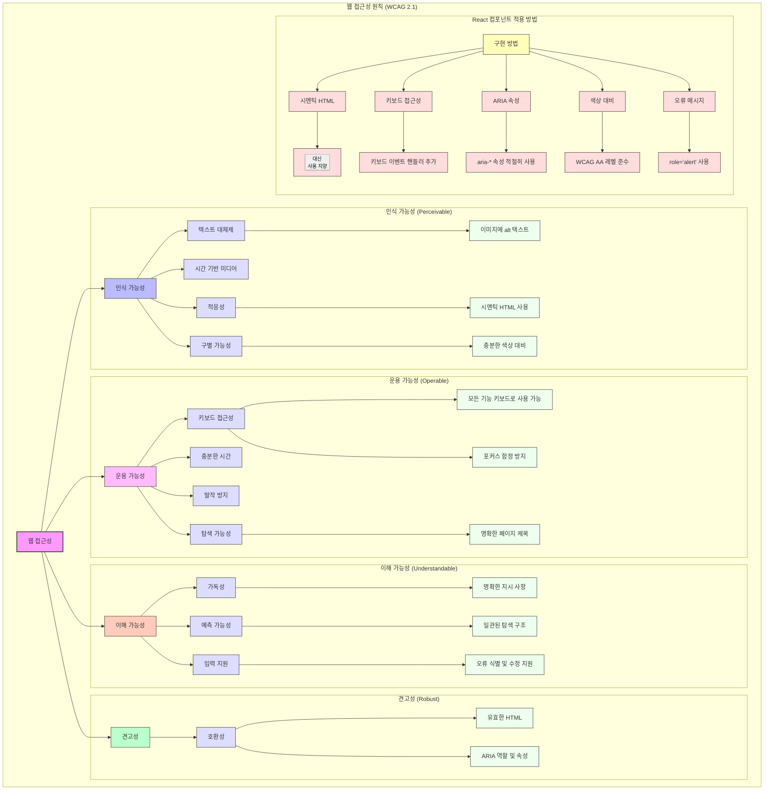

# 🧱 React 컴포넌트 개발 가이드

이 가이드는 **React + TypeScript 기반**의 컴포넌트를 일관성 있게 개발하기 위한 표준을 제공합니다.
유지보수성과 재사용성을 고려한 아키텍처, 네이밍 컨벤션, 테스트 및 접근성까지 포함하여 실무에 바로 적용 가능한 지침을 담고 있습니다.

> **이 가이드의 핵심 원칙**
> - 단일 책임 원칙
> - 관심사 분리
> - 재사용성 높은 구조로 설계
> - 명확한 타입 명세
> - 접근성 준수

## 목차

1. [폴더 구조](#폴더-구조)
2. [컴포넌트 작성 규칙](#컴포넌트-작성-규칙)
3. [타입스크립트 사용](#타입스크립트-사용)
4. [상수 정의](#상수-정의)
5. [Props 정의](#props-정의)
6. [이벤트 처리](#이벤트-처리)
7. [상태 관리](#상태-관리)
8. [훅 사용 가이드](#훅-사용-가이드)
9. [컴포넌트 디자인 패턴](#컴포넌트-디자인-패턴)
10. [비동기 처리](#비동기-처리)
11. [스타일 가이드](#스타일-가이드)
12. [스토리북 작성](#스토리북-작성)
13. [테스트 작성](#테스트-작성)
14. [컴포넌트 최적화](#컴포넌트-최적화)
15. [접근성 고려사항](#접근성-고려사항)

## 폴더 구조

컴포넌트는 다음과 같은 폴더 구조를 따릅니다:

```
src/components/
├── ComponentName/
│   ├── ComponentName.tsx         # 메인 컴포넌트 파일
│   ├── ComponentName.types.ts    # 타입 정의
│   ├── ComponentName.constants.ts  # 상수 정의
│   ├── ComponentName.stories.tsx # 스토리북 파일
│   ├── ComponentName.test.tsx    # 테스트 파일
│   └── index.ts                  # 내보내기 파일
```

> 💡 **팁**: 각 컴포넌트는 자체 폴더 내에 관련 파일을 모두 포함해야 합니다. 이렇게 하면 컴포넌트와 관련된 모든 파일을 한 곳에서 관리할 수 있습니다.

### 컴포넌트 구성 체크리스트
- [ ] 메인 컴포넌트 파일 생성 (`ComponentName.tsx`)
- [ ] 타입 정의 파일 분리 (`ComponentName.types.ts`)
- [ ] 상수 정의 파일 분리 (`ComponentName.constants.ts`)
- [ ] 스토리북 파일 작성 (`ComponentName.stories.tsx`)
- [ ] 테스트 파일 작성 (`ComponentName.test.tsx`)
- [ ] 내보내기 파일 작성 (`index.ts`)

## 컴포넌트 작성 규칙

### 기본 구조

```tsx
import React from 'react';
import { ComponentProps } from './ComponentName.types';
import { COMPONENT_DEFAULT } from './ComponentName.constants';

const ComponentName = ({
                         prop1,
                         prop2 = COMPONENT_DEFAULT.PROP2,
                         children,
                         className,
                         ...rest
                       }: ComponentProps) => {
  // 로직

  return (
    <div className={className} {...rest}>
      {children}
    </div>
  );
};

export default ComponentName;
```

> ⚠️ **주의**: 이전에는 `React.FC` 타입을 사용했었으나, 다음과 같은 이유로 더 이상 권장하지 않습니다:
> - `children` prop을 자동으로 타입에 포함시키지만, 모든 컴포넌트가 children을 받는 것은 아닙니다.
> - 제네릭을 사용할 때 문법이 복잡해집니다.
> - 명시적인 반환 타입 선언이 더 명확하고 유연합니다.
>
> 대신 Props 인터페이스를 직접 타입 애너테이션으로 사용하는 방식을 권장합니다.


### 명명 규칙

| 항목 | 규칙 | 예시 |
|------|------|------|
| **컴포넌트 이름** | PascalCase | `ButtonGroup.tsx` |
| **Props** | camelCase | `buttonSize` |
| **이벤트 핸들러** | `handle` 접두사 | `handleClick` |
| **파일 이름** | 컴포넌트와 동일한 PascalCase | `ButtonGroup.tsx` |

> ⚠️ **주의**: 컴포넌트 이름과 파일 이름이 일치하지 않으면 코드 검색 및 유지보수가 어려워질 수 있습니다.

## 타입스크립트 사용

- 모든 컴포넌트는 TypeScript를 사용하여 작성합니다.
- 타입 정의는 별도의 `.types.ts` 파일에 작성합니다.
- 인터페이스, 타입, 열거형은 명시적으로 내보내야 합니다.

### 타입 정의 권장 패턴

#### 옵션 제한 타입 정의하기

1. **`as const`와 타입 추론 활용하기** (권장)

```typescript
// ComponentName.types.ts
export const ButtonVariants = ['primary', 'secondary', 'tertiary'] as const;
export type ButtonVariant = typeof ButtonVariants[number];

export const ButtonSizes = ['small', 'medium', 'large'] as const;
export type ButtonSize = typeof ButtonSizes[number];

// 사용 예
interface ButtonProps {
  variant?: ButtonVariant;
  size?: ButtonSize;
  // 다른 props...
}
```

> 💡 **팁**: `as const`를 사용하면 배열에 값을 추가/제거할 때 타입이 자동으로 업데이트됩니다.

**장점**:
- 문자열 리터럴 타입을 자동으로 추론합니다.
- 배열에 값을 추가/제거하면 타입이 자동으로 업데이트됩니다.
- 상수 배열을 런타임에서도 사용할 수 있습니다.(검증, 목록 생성 등)
- Tree-shaking에 더 유리합니다.

2. **enum 사용하기** (특정 상황에서만 권장)

```typescript
// ComponentName.types.ts
export enum ButtonVariant {
  PRIMARY = 'primary',
  SECONDARY = 'secondary',
  TERTIARY = 'tertiary',
}

export enum ButtonSize {
  SMALL = 'small',
  MEDIUM = 'medium',
  LARGE = 'large',
}

// 사용 예
interface ButtonProps {
  variant?: ButtonVariant;
  size?: ButtonSize;
  // 다른 props...
}
```

> ⚠️ **주의**: enum은 다음 상황에서만 고려하세요:
> - 숫자 기반 열거형이 필요한 경우
> - 역매핑이 필요한 경우
> - 타입과 값이 정확히 일치해야 하는 특별한 상황

#### 객체 타입을 위한 인터페이스 정의

```typescript
// 일반적인 인터페이스 정의
export interface ComponentProps extends React.HTMLAttributes<HTMLDivElement> {
  variant: ButtonVariant;
  size: ButtonSize;
  isDisabled?: boolean;
}

// 중첩된 객체를 위한 인터페이스
export interface ComplexProps {
  user: {
    id: string;
    name: string;
    preferences: {
      theme: 'light' | 'dark';
      notifications: boolean;
    };
  };
  settings: Record<string, unknown>;
}
```

#### 유니온 타입 및 교차 타입

```typescript
// 유니온 타입
export type Status = 'idle' | 'loading' | 'success' | 'error';

// 교차 타입
export type DraggableComponent = ComponentProps & {
  draggable: boolean;
  onDragStart?: (e: React.DragEvent) => void;
};
```

#### 제네릭 타입

```typescript
// 제네릭 인터페이스
export interface ListProps<T> {
  items: T[];
  renderItem: (item: T, index: number) => React.ReactNode;
  keyExtractor: (item: T) => string;
}

// 제네릭 타입
export type SelectOption<T> = {
  label: string;
  value: T;
  disabled?: boolean;
};
```

### 타입스크립트 사용 체크리스트
- [ ] 컴포넌트 Props에 적절한 타입 정의
- [ ] 옵션이 제한된 경우 `as const` 활용
- [ ] 이벤트 핸들러에 정확한 이벤트 타입 지정
- [ ] 상태(state)에 명시적 타입 지정
- [ ] 제네릭 활용이 필요한 경우 적절히 사용

## 상수 정의

공통으로 사용되는 상수들은 별도의 `.constants.ts` 파일에 정의합니다:

```typescript
// ComponentName.constants.ts
export const COMPONENT_DEFAULT = {
  TYPE: 'button' as const,
  SIZE: 'medium' as const,
  VARIANT: 'primary' as const,
};
```

컴포넌트에서 사용:

```typescript
// ComponentName.tsx
import { COMPONENT_DEFAULT } from './ComponentName.constants';

const ComponentName = ({
                         type = COMPONENT_DEFAULT.TYPE,
                         size = COMPONENT_DEFAULT.SIZE,
                         variant = COMPONENT_DEFAULT.VARIANT,
                       }) => {
  // ...
}
```

## Props 정의

Props는 다음과 같은 방식으로 정의합니다:

```typescript
// 직접 인터페이스 정의
export interface ButtonProps extends React.ButtonHTMLAttributes<HTMLButtonElement> {
  variant?: ButtonVariant;
  size?: ButtonSize;
  disabled?: boolean;
  isLoading?: boolean;
}

// 또는 타입 가져오기
import { ComponentProps } from './Component.types';

// 사용 예시
const Component = ({
                     variant = COMPONENT_DEFAULT.VARIANT,
                     size = COMPONENT_DEFAULT.SIZE,
                     disabled = false,
                     children,
                     ...rest
                   }: ComponentProps) => {
  // ...
}
```

## 이벤트 처리

이벤트 핸들러는 다음과 같이 정의합니다:

```typescript
// 이벤트 핸들러 정의
const handleClick = (e: React.MouseEvent<HTMLButtonElement>) => {
  if (disabled || isLoading) return;

  // 필요한 로직 처리
  onClick?.(e);
};

// 컴포넌트에서 사용
return (
  <button
    onClick={handleClick}
disabled={disabled || isLoading}
className={buttonClasses}
>
{isLoading && <Spinner size="small" />}
{children}
</button>
);
```

## 상태 관리

본 프로젝트에서는 상태 관리를 위해 주로 Jotai와 React Query를 사용합니다.



### Jotai

Jotai는 간결하고 직관적인 전역 상태 관리 라이브러리입니다. 다음과 같이 사용합니다:

```typescript
// atoms/userAtom.ts
import { atom } from 'jotai';

// 기본 atom 정의
export const userAtom = atom({
  id: '',
  name: '',
  isLoggedIn: false,
});

// 파생 atom 정의
export const isLoggedInAtom = atom(
  (get) => get(userAtom).isLoggedIn
);

// 쓰기 가능한 파생 atom
export const userNameAtom = atom(
  (get) => get(userAtom).name,
  (get, set, newName: string) => {
    set(userAtom, {
      ...get(userAtom),
      name: newName,
    });
  }
);
```

컴포넌트에서 사용:

```typescript
import { useAtom, useAtomValue } from 'jotai';
import { userAtom, isLoggedInAtom, userNameAtom } from '../atoms/userAtom';

const UserProfile: React.FC = () => {
  // 전체 상태 읽기/쓰기
  const [user, setUser] = useAtom(userAtom);

  // 읽기 전용 값
  const isLoggedIn = useAtomValue(isLoggedInAtom);

  // 특정 필드 읽기/쓰기
  const [userName, setUserName] = useAtom(userNameAtom);

  return (
    <div>
      {isLoggedIn ? (
        <>
          <h1>안녕하세요, {userName}님!</h1>
          <input
            value={userName}
            onChange={(e) => setUserName(e.target.value)}
          />
        </>
      ) : (
        <button onClick={() => setUser({ id: '1', name: 'Guest', isLoggedIn: true })}>
          로그인
        </button>
      )}
    </div>
  );
};
```

> 💡 **팁**: Jotai는 작은 단위의 상태(atom)를 만들고 결합할 수 있어 Redux보다 보일러플레이트가 적습니다.

### React Query

서버 상태 관리와 데이터 페칭을 위해 React Query를 사용합니다:

```typescript
// hooks/useUsers.ts
import { useQuery, useMutation, useQueryClient } from '@tanstack/react-query';
import { fetchUsers, createUser, updateUser, deleteUser } from '../api/users';
import type { User } from '../types';

// 쿼리 키 상수
export const QUERY_KEYS = {
  USERS: 'users',
};

// 사용자 목록 조회
export const useUsers = () => {
  return useQuery({
    queryKey: [QUERY_KEYS.USERS],
    queryFn: fetchUsers,
  });
};

// 사용자 생성
export const useCreateUser = () => {
  const queryClient = useQueryClient();

  return useMutation({
    mutationFn: (newUser: Omit<User, 'id'>) => createUser(newUser),
    onSuccess: () => {
      queryClient.invalidateQueries({ queryKey: [QUERY_KEYS.USERS] });
    },
  });
};

// 사용자 수정
export const useUpdateUser = () => {
  const queryClient = useQueryClient();

  return useMutation({
    mutationFn: (updatedUser: User) => updateUser(updatedUser),
    onSuccess: (data, variables) => {
      queryClient.setQueryData(
        [QUERY_KEYS.USERS],
        (oldData: User[] | undefined) => {
          if (!oldData) return [data];
          return oldData.map(user =>
            user.id === variables.id ? variables : user
          );
        }
      );
    },
  });
};
```

컴포넌트에서 사용:

```typescript
import { useUsers, useCreateUser, useUpdateUser } from '../hooks/useUsers';

const UserManagement: React.FC = () => {
  const { data: users, isLoading, error } = useUsers();
  const createUserMutation = useCreateUser();
  const updateUserMutation = useUpdateUser();

  const handleCreateUser = () => {
    createUserMutation.mutate({ name: 'New User', email: 'new@example.com' });
  };

  const handleUpdateUser = (user: User) => {
    updateUserMutation.mutate({ ...user, name: `${user.name} (수정됨)` });
  };

  if (isLoading) return <div>로딩 중...</div>;
  if (error) return <div>에러 발생: {error.message}</div>;

  return (
    <div>
      <button onClick={handleCreateUser}>새 사용자 추가</button>
      {users?.map(user => (
        <div key={user.id}>
          {user.name}
          <button onClick={() => handleUpdateUser(user)}>수정</button>
        </div>
      ))}
    </div>
  );
};
```

## 훅 사용 가이드

### 커스텀 훅 작성

커스텀 훅은 로직을 재사용하기 위한 강력한 패턴입니다. 다음 규칙을 따릅니다:

1. 이름은 항상 `use`로 시작해야 합니다.
2. 한 가지 책임만 가져야 합니다.
3. 적절한 타입을 명시해야 합니다.
4. `/hooks` 디렉토리에 위치시킵니다.

```typescript
// hooks/useForm.ts
import { useState, ChangeEvent, FormEvent } from 'react';

interface UseFormProps<T> {
  initialValues: T;
  onSubmit: (values: T) => void;
  validate?: (values: T) => Partial<Record<keyof T, string>>;
}

interface UseFormReturn<T> {
  values: T;
  errors: Partial<Record<keyof T, string>>;
  handleChange: (e: ChangeEvent<HTMLInputElement>) => void;
  handleSubmit: (e: FormEvent<HTMLFormElement>) => void;
  reset: () => void;
  isSubmitting: boolean;
}

export function useForm<T extends Record<string, any>>({
  initialValues,
  onSubmit,
  validate,
}: UseFormProps<T>): UseFormReturn<T> {
  const [values, setValues] = useState<T>(initialValues);
  const [errors, setErrors] = useState<Partial<Record<keyof T, string>>>({});
  const [isSubmitting, setIsSubmitting] = useState(false);

  const handleChange = (e: ChangeEvent<HTMLInputElement>) => {
    const { name, value } = e.target;
    setValues({ ...values, [name]: value });
  };

  const handleSubmit = async (e: FormEvent<HTMLFormElement>) => {
    e.preventDefault();
    if (validate) {
      const validationErrors = validate(values);
      setErrors(validationErrors);

      if (Object.keys(validationErrors).length > 0) {
        return;
      }
    }

    setIsSubmitting(true);
    try {
      await onSubmit(values);
      reset();
    } finally {
      setIsSubmitting(false);
    }
  };

  const reset = () => {
    setValues(initialValues);
    setErrors({});
  };

  return { values, errors, handleChange, handleSubmit, reset, isSubmitting };
}
```

사용 예시:

```tsx
import { useForm } from '../hooks/useForm';

interface LoginFormValues {
  email: string;
  password: string;
}

const LoginForm: React.FC = () => {
  const {
    values,
    errors,
    handleChange,
    handleSubmit,
    isSubmitting
  } = useForm<LoginFormValues>({
    initialValues: { email: '', password: '' },
    validate: (values) => {
      const errors: Partial<Record<keyof LoginFormValues, string>> = {};
      if (!values.email) {
        errors.email = '이메일을 입력해주세요';
      }
      if (!values.password) {
        errors.password = '비밀번호를 입력해주세요';
      }
      return errors;
    },
    onSubmit: async (values) => {
      // API 호출 등 비동기 작업 수행
      console.log('로그인 시도:', values);
    },
  });

  return (
    <form onSubmit={handleSubmit}>
      <div>
        <label htmlFor="email">이메일</label>
        <input
          id="email"
          name="email"
          type="email"
          value={values.email}
          onChange={handleChange}
        />
        {errors.email && <p>{errors.email}</p>}
      </div>
      <div>
        <label htmlFor="password">비밀번호</label>
        <input
          id="password"
          name="password"
          type="password"
          value={values.password}
          onChange={handleChange}
        />
        {errors.password && <p>{errors.password}</p>}
      </div>
      <button type="submit" disabled={isSubmitting}>
        {isSubmitting ? '로그인 중...' : '로그인'}
      </button>
    </form>
  );
};
```

### 훅 사용 시 주의사항

1. **의존성 배열 관리**: useEffect, useMemo, useCallback의 의존성 배열을 정확히 관리합니다.
2. **조건부 훅 사용 금지**: 훅은 항상 컴포넌트의 최상위 레벨에서 호출해야 합니다.
3. **타이밍 이슈 방지**: 비동기 코드에서 훅을 사용할 때는 컴포넌트 언마운트 상황을 고려합니다.

```typescript
// 좋은 예
useEffect(() => {
  let isMounted = true;

  const fetchData = async () => {
    const result = await api.getData();
    if (isMounted) {
      setData(result);
    }
  };

  fetchData();

  return () => {
    isMounted = false;
  };
}, []);

// 나쁜 예 - 조건부 훅 사용
if (condition) {
  useEffect(() => {
    // 이렇게 하면 안 됨!
  }, []);
}
```


### 자주 사용하는 훅 패턴

| 패턴 | 사용 사례 |
|------|-----------|
| **useState + useCallback** | 이벤트 핸들러 최적화 |
| **useReducer** | 복잡한 상태 로직 관리 |
| **useContext + useReducer** | 전역 상태 관리 간소화 |
| **useRef + useEffect** | DOM 조작, 이전 값 참조 |

## 컴포넌트 디자인 패턴

효과적인 React 컴포넌트를 구성하기 위한 여러 디자인 패턴들을 활용합니다:



### Compound Components

관련 컴포넌트들을 그룹화하여 내부 상태를 공유하는 패턴입니다:

```tsx
// components/Select/Select.tsx
import React, { createContext, useState, useContext } from 'react';

// 1. Context 생성
interface SelectContextType {
  value: string;
  onChange: (value: string) => void;
  isOpen: boolean;
  toggle: () => void;
  close: () => void;
}

const SelectContext = createContext<SelectContextType | undefined>(undefined);

// 2. Context 사용을 위한 훅
const useSelectContext = () => {
  const context = useContext(SelectContext);
  if (!context) {
    throw new Error('Select 컴포넌트 내부에서만 사용할 수 있습니다');
  }
  return context;
};

// 3. 부모 컴포넌트 정의
interface SelectProps {
  value: string;
  onChange: (value: string) => void;
  children: React.ReactNode;
  className?: string;
}

const Select: React.FC<SelectProps> & {
  Trigger: typeof Trigger;
  Options: typeof Options;
  Option: typeof Option;
} = ({ value, onChange, children, className }) => {
  const [isOpen, setIsOpen] = useState(false);

  const toggle = () => setIsOpen(prev => !prev);
  const close = () => setIsOpen(false);

  return (
    <SelectContext.Provider value={{ value, onChange, isOpen, toggle, close }}>
      <div className={`select ${className || ''}`}>
        {children}
      </div>
    </SelectContext.Provider>
  );
};

// 4. 자식 컴포넌트들 정의
const Trigger: React.FC<React.HTMLAttributes<HTMLDivElement>> = (props) => {
  const { toggle, value } = useSelectContext();

  return (
    <div
      {...props}
      role="button"
      tabIndex={0}
      onClick={toggle}
      className={`select-trigger ${props.className || ''}`}
    >
      {value || '선택'}
    </div>
  );
};

const Options: React.FC<React.HTMLAttributes<HTMLDivElement>> = (props) => {
  const { isOpen } = useSelectContext();

  if (!isOpen) return null;

  return (
    <div {...props} className={`select-options ${props.className || ''}`}>
      {props.children}
    </div>
  );
};

const Option: React.FC<{
  value: string;
  children: React.ReactNode;
  className?: string;
}> = ({ value, children, className, ...props }) => {
  const { onChange, close, value: selectedValue } = useSelectContext();

  const handleClick = () => {
    onChange(value);
    close();
  };

  return (
    <div
      {...props}
      role="option"
      aria-selected={value === selectedValue}
      onClick={handleClick}
      className={`select-option ${value === selectedValue ? 'selected' : ''} ${className || ''}`}
    >
      {children}
    </div>
  );
};

// 5. 자식 컴포넌트를 부모에 연결
Select.Trigger = Trigger;
Select.Options = Options;
Select.Option = Option;

export default Select;
```

> 💡 **팁**: Compound Components 패턴은 세부 구현을 숨기면서도 컴포넌트 사용에 유연성을 제공합니다.

사용 예시:

```tsx
const SelectExample: React.FC = () => {
  const [value, setValue] = useState('');

  return (
    <Select value={value} onChange={setValue}>
      <Select.Trigger />
      <Select.Options>
        <Select.Option value="option1">옵션 1</Select.Option>
        <Select.Option value="option2">옵션 2</Select.Option>
        <Select.Option value="option3">옵션 3</Select.Option>
      </Select.Options>
    </Select>
  );
};
```

### Render Props 패턴

컴포넌트의 렌더링 로직을 상위 컴포넌트에 위임하는 패턴입니다:

```tsx
// components/List/List.tsx
import React from 'react';

interface ListProps<T> {
  items: T[];
  renderItem: (item: T, index: number) => React.ReactNode;
  keyExtractor: (item: T, index: number) => string;
  className?: string;
  emptyComponent?: React.ReactNode;
}

function List<T>({
  items,
  renderItem,
  keyExtractor,
  className,
  emptyComponent = <div>데이터가 없습니다</div>,
}: ListProps<T>) {
  if (items.length === 0) {
    return <>{emptyComponent}</>;
  }

  return (
    <ul className={className}>
      {items.map((item, index) => (
        <li key={keyExtractor(item, index)}>
          {renderItem(item, index)}
        </li>
      ))}
    </ul>
  );
}

export default List;
```

사용 예시:

```tsx
interface User {
  id: string;
  name: string;
  email: string;
}

const UserList: React.FC = () => {
  const { data: users } = useUsers();

  return (
    <List<User>
      items={users || []}
      keyExtractor={(user) => user.id}
      renderItem={(user) => (
        <div className="user-item">
          <h3>{user.name}</h3>
          <p>{user.email}</p>
        </div>
      )}
      emptyComponent={<p>사용자 정보가 없습니다</p>}
    />
  );
};
```

> 💡 **팁**: Render Props 패턴은 컴포넌트 간의 결합도를 낮추고 재사용성을 높입니다.

### 고차 컴포넌트 (HOC)

기존 컴포넌트를 감싸서 새로운 기능을 추가하는 패턴입니다:

```tsx
// hocs/withLoading.tsx
import React from 'react';

interface WithLoadingProps {
  isLoading: boolean;
}

export function withLoading<P extends object>(
  Component: React.ComponentType<P>,
  LoadingComponent: React.ComponentType = () => <div>로딩 중...</div>
) {
  return function WithLoadingComponent({
    isLoading,
    ...props
  }: P & WithLoadingProps) {
    if (isLoading) {
      return <LoadingComponent />;
    }

    return <Component {...(props as P)} />;
  };
}
```

사용 예시:

```tsx
const UserProfile: React.FC<{ user: User }> = ({ user }) => (
  <div>
    <h2>{user.name}</h2>
    <p>{user.email}</p>
  </div>
);

const UserProfileWithLoading = withLoading(UserProfile);

// 사용
const UserProfilePage: React.FC = () => {
  const { data: user, isLoading } = useUser(userId);

  return (
    <UserProfileWithLoading
      isLoading={isLoading}
      user={user}
    />
  );
};
```

### 디자인 패턴 선택 가이드

| 패턴 | 사용 시기 | 장점 | 단점 |
|------|-----------|------|------|
| **Compound Components** | 관련된 UI 요소들이 함께 작동할 때 | API 노출 최소화, 유연한 구성 | 컴포넌트 간 결합도 증가 |
| **Render Props** | 렌더링 로직을 재사용할 때 | 높은 유연성, 타입 안전성 | 중첩될 경우 복잡해짐 |
| **HOC** | 기존 컴포넌트에 기능 추가할 때 | 관심사 분리 | props 충돌 가능성 |

> ⚠️ **주의**: 한 컴포넌트에 여러 HOC를 적용할 때는 props 이름 충돌에 주의하세요.

## 비동기 처리

비동기 작업 처리를 위한 패턴들입니다:



### React Query를 사용한 데이터 페칭

```typescript
// hooks/usePost.ts
import { useQuery, useMutation, useQueryClient } from '@tanstack/react-query';
import { fetchPost, updatePost } from '../api/posts';

export const usePost = (id: string) => {
  return useQuery({
    queryKey: ['post', id],
    queryFn: () => fetchPost(id),
    // 1분간 캐시 데이터 유지
    staleTime: 60 * 1000,
    // 캐시된 데이터가 있으면 먼저 보여주고 백그라운드에서 업데이트
    refetchOnMount: 'always',
  });
};

export const useUpdatePost = () => {
  const queryClient = useQueryClient();

  return useMutation({
    mutationFn: updatePost,
    // 낙관적 업데이트
    onMutate: async (newPost) => {
      await queryClient.cancelQueries({ queryKey: ['post', newPost.id] });
      const previousPost = queryClient.getQueryData(['post', newPost.id]);

      queryClient.setQueryData(['post', newPost.id], newPost);

      return { previousPost };
    },
    // 실패 시 롤백
    onError: (err, newPost, context) => {
      queryClient.setQueryData(
        ['post', newPost.id],
        context?.previousPost
      );
    },
    // 성공 시 관련 쿼리 무효화
    onSuccess: (data) => {
      queryClient.invalidateQueries({ queryKey: ['posts'] });
    },
  });
};
```

> 💡 **팁**: React Query는 캐싱, 백그라운드 갱신, 낙관적 업데이트 등을 쉽게 구현할 수 있습니다.

### 비동기 상태 관리

다음은 비동기 작업의 상태를 추적하는 커스텀 훅입니다:

```typescript
// hooks/useAsync.ts
import { useState, useCallback, useEffect } from 'react';

interface UseAsyncOptions {
  immediate?: boolean;
  onSuccess?: (data: any) => void;
  onError?: (error: Error) => void;
}

interface UseAsyncState<T> {
  value: T | null;
  error: Error | null;
  status: 'idle' | 'pending' | 'success' | 'error';
}

interface UseAsyncReturn<T> extends UseAsyncState<T> {
  execute: (...args: any[]) => Promise<T>;
  reset: () => void;
  isIdle: boolean;
  isPending: boolean;
  isSuccess: boolean;
  isError: boolean;
}

export function useAsync<T>(
  asyncFunction: (...args: any[]) => Promise<T>,
  options: UseAsyncOptions = {}
): UseAsyncReturn<T> {
  const { immediate = false, onSuccess, onError } = options;

  const [state, setState] = useState<UseAsyncState<T>>({
    value: null,
    error: null,
    status: 'idle',
  });

  const execute = useCallback(
    async (...args: any[]) => {
      setState({ value: null, error: null, status: 'pending' });

      try {
        const response = await asyncFunction(...args);
        setState({ value: response, error: null, status: 'success' });
        onSuccess?.(response);
        return response;
      } catch (error) {
        const errorInstance = error instanceof Error ? error : new Error(String(error));
        setState({ value: null, error: errorInstance, status: 'error' });
        onError?.(errorInstance);
        throw errorInstance;
      }
    },
    [asyncFunction, onSuccess, onError]
  );

  const reset = useCallback(() => {
    setState({ value: null, error: null, status: 'idle' });
  }, []);

  useEffect(() => {
    if (immediate) {
      execute();
    }
  }, [execute, immediate]);

  return {
    ...state,
    execute,
    reset,
    isIdle: state.status === 'idle',
    isPending: state.status === 'pending',
    isSuccess: state.status === 'success',
    isError: state.status === 'error',
  };
}
```

사용 예시:

```tsx
const SaveButton: React.FC<{ data: FormData }> = ({ data }) => {
  const {
    execute: saveData,
    isPending,
    isError,
    error
  } = useAsync(api.saveData);

  const handleSave = async () => {
    try {
      await saveData(data);
      toast.success('저장되었습니다');
    } catch (err) {
      // 오류는 훅 내부에서 이미 처리됨
    }
  };

  return (
    <>
      <button onClick={handleSave} disabled={isPending}>
        {isPending ? '저장 중...' : '저장'}
      </button>
      {isError && <div className="error">{error?.message}</div>}
    </>
  );
};
```

### 비동기 작업 취소

AbortController를 활용한 비동기 작업 취소 예시:

```typescript
// 컴포넌트에서 활용 예시
const SearchComponent: React.FC = () => {
  const [query, setQuery] = useState('');
  const [results, setResults] = useState([]);
  const [isLoading, setIsLoading] = useState(false);

  useEffect(() => {
    if (!query) {
      setResults([]);
      return;
    }

    const controller = new AbortController();
    const { signal } = controller;

    const fetchResults = async () => {
      setIsLoading(true);
      try {
        const data = await api.search(query, { signal });
        setResults(data);
      } catch (error) {
        if (error.name === 'AbortError') {
          // 요청이 취소됨 - 무시
          console.log('검색 요청 취소됨');
        } else {
          console.error('검색 오류:', error);
        }
      } finally {
        setIsLoading(false);
      }
    };

    fetchResults();

    // cleanup 함수에서 요청 취소
    return () => {
      controller.abort();
    };
  }, [query]);

  return (
    <div>
      <input
        type="text"
        value={query}
        onChange={(e) => setQuery(e.target.value)}
        placeholder="검색어 입력..."
      />
      {isLoading && <div>검색 중...</div>}
      <ul>
        {results.map(item => (
          <li key={item.id}>{item.title}</li>
        ))}
      </ul>
    </div>
  );
};
```

> ⚠️ **주의**: 컴포넌트가 언마운트되기 전에 진행 중인 비동기 작업을 취소하지 않으면 메모리 누수가 발생할 수 있습니다.

### 비동기 처리 패턴 비교

| 패턴 | 장점 | 단점 | 사용 사례 |
|------|------|------|-----------|
| **React Query** | 캐싱, 자동 재시도, 낙관적 업데이트 | 설정이 복잡할 수 있음 | API 데이터 페칭 |
| **useAsync 훅** | 상태 관리 간소화, 재사용성 | 기능이 제한적 | 단일 비동기 작업 |
| **AbortController** | 불필요한 요청 취소 | 브라우저 호환성 고려 필요 | 검색, 자동완성 |

### 비동기 패턴 체크리스트
- [ ] 로딩, 오류, 성공 상태 처리
- [ ] 사용자 피드백 제공 (로딩 스피너, 오류 메시지)
- [ ] 실패 시 재시도 메커니즘 구현
- [ ] 컴포넌트 언마운트 시 요청 취소
- [ ] 낙관적 업데이트 고려

```typescript
// 컴포넌트에서 활용 예시
const SearchComponent: React.FC = () => {
  const [query, setQuery] = useState('');
  const [results, setResults] = useState([]);
  const [isLoading, setIsLoading] = useState(false);

  useEffect(() => {
    if (!query) {
      setResults([]);
      return;
    }

    const controller = new AbortController();
    const { signal } = controller;

    const fetchResults = async () => {
      setIsLoading(true);
      try {
        const data = await api.search(query, { signal });
        setResults(data);
      } catch (error) {
        if (error.name === 'AbortError') {
          // 요청이 취소됨 - 무시
          console.log('검색 요청 취소됨');
        } else {
          console.error('검색 오류:', error);
        }
      } finally {
        setIsLoading(false);
      }
    };

    fetchResults();

    // cleanup 함수에서 요청 취소
    return () => {
      controller.abort();
    };
  }, [query]);

  return (
    <div>
      <input
        type="text"
        value={query}
        onChange={(e) => setQuery(e.target.value)}
        placeholder="검색어 입력..."
      />
      {isLoading && <div>검색 중...</div>}
      <ul>
        {results.map(item => (
          <li key={item.id}>{item.title}</li>
        ))}
      </ul>
    </div>
  );
};
```

## 스타일 가이드

컴포넌트 스타일링은 다음 규칙을 따릅니다:

- [사내 마크업 가이드](./MARKUP_GUIDE.md)를 따름

### 스타일링 체크리스트

- [ ] 사내 마크업 가이드의 규칙대로 작성되었는가
- [ ] 접근성 고려 (색상 대비, 상태 표시)

## 스토리북 작성

각 컴포넌트는 해당하는 스토리북 파일을 가져야 합니다:

```typescript
// ComponentName.stories.tsx
import type { Meta, StoryObj } from '@storybook/react';
import ComponentName from './ComponentName';
import { COMPONENT_DEFAULT } from './ComponentName.constants';

const meta = {
  title: 'Components/ComponentName',
  component: ComponentName,
  parameters: {
    layout: 'centered',
    docs: {
      description: {
        component: '컴포넌트에 대한 설명을 여기에 작성합니다.',
      },
    },
  },
  tags: ['autodocs'],
  argTypes: {
    // 컴포넌트 props의 컨트롤 정의
    variant: {
      control: 'select',
      options: ['primary', 'secondary'],
      description: '컴포넌트의 시각적 스타일을 결정합니다.',
    },
  },
} satisfies Meta<typeof ComponentName>;

export default meta;
type Story = StoryObj<typeof ComponentName>;

// 기본 스토리
export const Default: Story = {
  args: {
    variant: COMPONENT_DEFAULT.VARIANT,
    size: COMPONENT_DEFAULT.SIZE,
    children: '버튼',
  },
};

// 추가 스토리
export const CustomVariant: Story = {
  args: {
    variant: 'secondary',
    children: '보조 버튼',
  },
};

// 로딩 상태 스토리
export const Loading: Story = {
  args: {
    isLoading: true,
    children: '로딩 중',
  },
};
```

### 스토리북 작성 모범 사례



#### 스토리 구성

| 스토리 유형 | 설명 | 예시 |
|------------|------|------|
| **기본** | 기본 속성으로 컴포넌트 표시 | `Default.args = { children: '버튼' }` |
| **변형** | 다양한 속성 조합 표시 | `Primary.args = { variant: 'primary' }` |
| **상태** | 다양한 상태 표시 | `Disabled.args = { disabled: true }` |
| **크기** | 다양한 크기 표시 | `Small.args = { size: 'small' }` |
| **컴포지션** | 다른 컴포넌트와 조합 | `WithIcon.args = { icon: <Icon /> }` |

> 💡 **팁**: argTypes를 활용하여 문서화와 컨트롤을 개선할 수 있습니다.

### 스토리북 문서화

```typescript
// .storybook/preview.ts
export const parameters = {
  actions: { argTypesRegex: '^on[A-Z].*' },
  controls: {
    matchers: {
      color: /(background|color)$/i,
      date: /Date$/,
    },
  },
  docs: {
    source: {
      state: 'open',
    },
  },
};
```

### 스토리북 체크리스트

- [ ] 모든 컴포넌트에 대한 기본 스토리 작성
- [ ] 다양한 상태와 변형에 대한 스토리 추가
- [ ] props에 대한 설명 문서화
- [ ] 컴포넌트 사용 예시 제공
- [ ] 액션(이벤트) 연결 및 테스트

## 테스트 작성

컴포넌트 테스트는 다음을 포함해야 합니다:

### 테스트 유형

1. **기본 렌더링 테스트**: 컴포넌트가 에러 없이 렌더링되는지 확인
2. **Props 변경 테스트**: Props에 따라 컴포넌트가 올바르게 동작하는지 확인
3. **이벤트 핸들링 테스트**: 사용자 상호작용이 올바르게 처리되는지 확인
4. **조건부 렌더링 테스트**: 조건에 따라 UI 요소가 올바르게 표시/숨김 처리되는지 확인

```typescript
// ComponentName.test.tsx
import { render, screen, fireEvent } from '@testing-library/react';
import ComponentName from './ComponentName';

describe('ComponentName', () => {
  it('renders correctly', () => {
    render(<ComponentName>Test Content</ComponentName>);
    expect(screen.getByText('Test Content')).toBeInTheDocument();
  });

  it('handles click events', () => {
    const handleClick = jest.fn();
    render(<ComponentName onClick={handleClick}>Click Me</ComponentName>);
    fireEvent.click(screen.getByText('Click Me'));
    expect(handleClick).toHaveBeenCalledTimes(1);
  });

  it('applies correct classes based on props', () => {
    const { container } = render(
      <ComponentName variant="secondary" size="large">Button</ComponentName>
    );
    expect(container.firstChild).toHaveClass('btn--secondary');
    expect(container.firstChild).toHaveClass('btn--large');
  });

  it('does not call onClick when disabled', () => {
    const handleClick = jest.fn();
    render(
      <ComponentName onClick={handleClick} disabled>
        Disabled Button
      </ComponentName>
    );
    fireEvent.click(screen.getByText('Disabled Button'));
    expect(handleClick).not.toHaveBeenCalled();
  });
});
```

### 테스트 패턴

| 패턴 | 설명 | 예시 |
|------|------|------|
| **AAA 패턴** | Arrange-Act-Assert | 설정하고, 실행하고, 검증하는 구조 |
| **각각 테스트** | 각 테스트는 하나의 동작만 테스트 | 여러 기능을 한 테스트에서 검증하지 않음 |
| **격리된 테스트** | 테스트 간 의존성 없이 독립적으로 실행 | 테스트 순서에 의존하지 않음 |

> 💡 **팁**: 테스트 코드도 프로덕션 코드처럼 유지보수가 필요합니다. 가독성과 유지보수성을 고려하세요.

### 모의(Mock) 객체 사용

```typescript
// 함수 모의
const mockFn = jest.fn();

// 모듈 모의
jest.mock('../api', () => ({
  fetchData: jest.fn().mockResolvedValue({ data: 'test' }),
}));

// 타이머 모의
jest.useFakeTimers();
```

### 비동기 테스트

```typescript
// 비동기 기능 테스트
it('loads data asynchronously', async () => {
  render(<DataLoader />);

  // 로딩 상태 확인
  expect(screen.getByText('로딩 중...')).toBeInTheDocument();

  // 데이터 로드 대기
  await screen.findByText('데이터 로드 완료');

  // 결과 확인
  expect(screen.queryByText('로딩 중...')).not.toBeInTheDocument();
  expect(screen.getByText('항목 1')).toBeInTheDocument();
});
```

### 테스트 체크리스트

- [ ] 모든 컴포넌트에 기본 렌더링 테스트 작성
- [ ] 모든 사용자 상호작용에 대한 테스트 작성
- [ ] Props 및 상태 변경에 따른 동작 테스트
- [ ] 에지 케이스 및 오류 상황 테스트
- [ ] 테스트 커버리지 80% 이상 유지

## 컴포넌트 최적화

컴포넌트 성능 최적화를 위한 기법들입니다:

### 메모이제이션 기법



#### React.memo

자주 리렌더링되지만 입력이 자주 변경되지 않는 컴포넌트에 `React.memo` 사용:

```typescript
// 단순 메모이제이션
const MemoizedComponent = React.memo(ComponentName);

// 커스텀 비교 함수 추가
const MemoizedComponentWithCustomCompare = React.memo(ComponentName, (prevProps, nextProps) => {
  // 필요한 비교 로직 - true 반환 시 리렌더링 방지
  return prevProps.value === nextProps.value;
});
```

> ⚠️ **주의**: 모든 컴포넌트를 무조건 메모이제이션하면 오히려 성능이 저하될 수 있습니다.

#### useMemo와 useCallback

```typescript
// 복잡한 계산 결과 메모이제이션
const memoizedValue = useMemo(() => {
  return computeExpensiveValue(a, b);
}, [a, b]); // 의존성 배열 - a나 b가 변경될 때만 재계산

// 함수 메모이제이션
const memoizedCallback = useCallback(() => {
  doSomething(a, b);
}, [a, b]); // 의존성 배열 - a나 b가 변경될 때만 함수 재생성
```

### 코드 분할(Code Splitting)

큰 컴포넌트나 페이지를 필요할 때만 로드하도록 분할:

```typescript
// 동적 임포트를 이용한 지연 로딩
const LazyComponent = React.lazy(() => import('./LazyComponent'));

// 사용 예시 - Suspense와 함께 사용
const MyComponent = () => (
  <Suspense fallback={<Spinner />}>
    <LazyComponent />
  </Suspense>
);
```

### 가상화(Virtualization)

대량의 데이터를 표시할 때 화면에 보이는 부분만 렌더링:

```tsx
import { FixedSizeList } from 'react-window';

const VirtualizedList = ({ items }) => (
  <FixedSizeList
    height={500}
    width={300}
    itemCount={items.length}
    itemSize={50}
  >
    {({ index, style }) => (
      <div style={style}>
        {items[index].name}
      </div>
    )}
  </FixedSizeList>
);
```

### 성능 모니터링

React DevTools Profiler를 사용하여 성능 병목 지점 식별:

```typescript
// 개발 모드에서만 프로파일링 활성화
if (process.env.NODE_ENV === 'development') {
  const { whyDidYouUpdate } = require('why-did-you-render');
  whyDidYouUpdate(React);
}
```

### 최적화 체크리스트

- [ ] 불필요한 렌더링을 방지하기 위해 React.memo 적절히 사용
- [ ] 고비용 계산에 useMemo 사용
- [ ] 이벤트 핸들러에 useCallback 사용
- [ ] 대용량 목록에 가상화 기법 적용
- [ ] 큰 컴포넌트는 코드 분할로 지연 로딩
- [ ] 컴포넌트 렌더링 성능 정기적으로 프로파일링

## 접근성 고려사항

컴포넌트 개발 시 접근성을 고려해야 합니다:

### 시멘틱 HTML 사용

적절한 HTML 요소를 사용하여 의미를 명확하게 전달합니다:

```tsx
// 좋은 예: 의미에 맞는 요소 사용
<button onClick={handleClick} disabled={isDisabled}>
  {children}
</button>

// 나쁜 예: 의미에 맞지 않는 요소에 역할 추가
<div onClick={handleClick} role="button" tabIndex={0}>
  {children}
</div>
```

> ⚠️ **주의**: 시멘틱 요소를 사용하면 키보드 접근성, 스크린 리더 지원 등이 자동으로 제공됩니다.

### 키보드 접근성

모든 상호작용은 키보드로도 가능해야 합니다:

```tsx
// 키보드 이벤트 처리
const handleKeyDown = (e: React.KeyboardEvent) => {
  if (e.key === 'Enter' || e.key === ' ') {
    handleAction();
  }
};

// div를 버튼처럼 사용해야 하는 경우 (가급적 피하세요)
return (
  <div
    role="button"
    tabIndex={0}
    onClick={handleAction}
    onKeyDown={handleKeyDown}
    aria-disabled={disabled}
  >
    {children}
  </div>
);
```

### ARIA 속성 적용

적절한 ARIA 역할, 상태, 속성을 제공합니다:

```tsx
// 상태 표시
<button
  aria-pressed={isActive}
  aria-disabled={disabled}
  aria-busy={isLoading}
  disabled={disabled}
>
  {isLoading && <Spinner aria-hidden="true" />}
  {children}
</button>

// 관계 표시
<div role="tablist">
  <button
    role="tab"
    id="tab-1"
    aria-selected={selectedTab === 1}
    aria-controls="panel-1"
  >
    Tab 1
  </button>
  <div
    role="tabpanel"
    id="panel-1"
    aria-labelledby="tab-1"
    hidden={selectedTab !== 1}
  >
    Panel 1 Content
  </div>
</div>
```

### 색상 대비 및 가시성

충분한 색상 대비를 제공하여 가독성을 보장합니다:

```css
/* 모든 사용자가 인식할 수 있는 충분한 색상 대비 */
:root {
  --text-color: #333;
  --background-color: #fff;
  --focus-color: #0077ff;

  /* 다크 모드 */
  @media (prefers-color-scheme: dark) {
    --text-color: #f0f0f0;
    --background-color: #222;
    --focus-color: #66aaff;
  }
}

.button:focus {
  outline: 2px solid var(--focus-color);
  outline-offset: 2px;
}
```

### 오류 메시지 및 알림

스크린 리더가 인식할 수 있는 오류 메시지 및 알림을 제공합니다:

```tsx
<div className="form-group">
  <label htmlFor="email">이메일</label>
  <input
    id="email"
    type="email"
    value={email}
    onChange={handleChange}
    aria-invalid={!!error}
    aria-describedby={error ? "email-error" : undefined}
  />
  {error && (
    <div
      id="email-error"
      className="error-message"
      role="alert"
    >
      {error}
    </div>
  )}
</div>
```

### 접근성 체크리스트

- [ ] 시멘틱 HTML 요소 사용
- [ ] 키보드 탐색 및 조작 지원
- [ ] 적절한 ARIA 속성 제공
- [ ] 충분한 색상 대비 보장
- [ ] 스크린 리더 호환성 테스트
- [ ] 텍스트 크기 조정 가능
- [ ] 포커스 표시 명확히 구현
- [ ] 모션 축소 모드 지원 고려



## 모범 사례

React 컴포넌트 개발을 위한 모범 사례입니다:

### 1. 컴포넌트 설계 원칙

| 원칙 | 설명 | 이점 |
|------|------|------|
| **단일 책임** | 각 컴포넌트는 한 가지 역할만 담당 | 유지보수성 향상, 재사용성 증가 |
| **낮은 결합도** | 다른 컴포넌트에 대한 의존성 최소화 | 독립적인 개발과 테스트 가능 |
| **컴포지션** | 상속 대신 합성을 통한 기능 확장 | 유연한 컴포넌트 구조 |
| **불변성** | 상태 직접 수정 대신 불변 업데이트 | 예측 가능한 상태 변화, 버그 감소 |

> 💡 **팁**: "작은 컴포넌트가 좋은 컴포넌트"라는 원칙을 기억하세요. 큰 컴포넌트는 작은 컴포넌트로 분리하면 유지보수와 재사용이 쉬워집니다.

### 2. 코드 품질 개선

```tsx
// 문서화: 복잡한 로직에 주석 추가
/**
 * 페이지네이션 처리를 위한 계산
 * @param totalItems 전체 아이템 수
 * @param itemsPerPage 페이지당 아이템 수
 * @param currentPage 현재 페이지 (0부터 시작)
 * @returns 화면에 표시할 아이템 인덱스 범위
 */
const calculatePaginationRange = (
  totalItems: number,
  itemsPerPage: number,
  currentPage: number
): [number, number] => {
  const startIndex = currentPage * itemsPerPage;
  const endIndex = Math.min(startIndex + itemsPerPage, totalItems);
  return [startIndex, endIndex];
};
```

### 3. 오류 처리 전략

에러 발생 시 우아하게 처리할 수 있는 방법을 구현합니다:

```tsx
// 에러 바운더리 컴포넌트
class ErrorBoundary extends React.Component<
  { fallback?: React.ReactNode; children: React.ReactNode },
  { hasError: boolean }
> {
  state = { hasError: false };

  static getDerivedStateFromError() {
    return { hasError: true };
  }

  componentDidCatch(error: Error, info: React.ErrorInfo) {
    // 에러 로깅 서비스에 보고
    console.error('컴포넌트 에러:', error, info);
  }

  render() {
    if (this.state.hasError) {
      return this.props.fallback || <div>문제가 발생했습니다. 페이지를 새로고침해주세요.</div>;
    }
    return this.props.children;
  }
}

// 사용 방법
<ErrorBoundary fallback={<ErrorFallback />}>
  <MyComponent />
</ErrorBoundary>
```

### 4. 성능과 최적화 팁

- **조건부 렌더링**: 큰 컴포넌트 트리의 렌더링을 방지
  ```tsx
  {isDetailsVisible && <Details data={data} />}
  ```

- **이벤트 위임**: 개별 항목마다 이벤트 핸들러를 연결하지 않고 부모에 연결
  ```tsx
  <ul onClick={handleItemClick}>
    {items.map(item => <li data-id={item.id} key={item.id}>{item.name}</li>)}
  </ul>
  ```

- **지연 로딩 및 코드 분할**: 초기 로드 시간 단축
  ```tsx
  const Dashboard = React.lazy(() => import('./Dashboard'));
  ```

### 5. 팀 협업을 위한 권장사항

- **일관된 코드 스타일**: Biome 또는 ESLint + Prettier 사용
- **명확한 컴포넌트 문서화**: JSDoc, 스토리북 활용
- **코드 리뷰 체크리스트**: 성능, 접근성, 테스트 포함
- **버전 관리와 변경 이력**: 의미 있는 커밋 메시지

## 빌드 및 배포 고려사항

효율적인 빌드와 배포를 위한 고려사항입니다:

### 1. 트리 쉐이킹 최적화

```typescript
// 좋은 예: 개별 가져오기로 트리 쉐이킹 가능
import { Button } from 'ui-library';

// 나쁜 예: 전체 가져오기로 번들 크기 증가
import * as UI from 'ui-library';
```

### 2. 청크 분할

```typescript
// webpack.config.js
module.exports = {
  // ...
  optimization: {
    splitChunks: {
      chunks: 'all',
      cacheGroups: {
        vendors: {
          test: /[\\/]node_modules[\\/]/,
          name: 'vendors',
          chunks: 'all',
        },
      },
    },
  },
};
```

### 3. 환경별 빌드 설정

```typescript
// .env.development, .env.production 활용
const apiUrl = process.env.REACT_APP_API_URL;

// 개발용 로깅
if (process.env.NODE_ENV === 'development') {
  console.log('현재 상태:', state);
}
```

### 4. 배포 환경 지원

- **다양한 모듈 형식**: ESM, CommonJS 지원
- **번들 분석**: webpack-bundle-analyzer 활용
- **성능 모니터링**: Lighthouse, Web Vitals 활용

---

이 가이드를 준수함으로써 일관된 스타일의 React 컴포넌트를 개발하고 유지보수할 수 있습니다. 기술이 발전함에 따라 이 가이드도 지속적으로 업데이트될 예정입니다.
