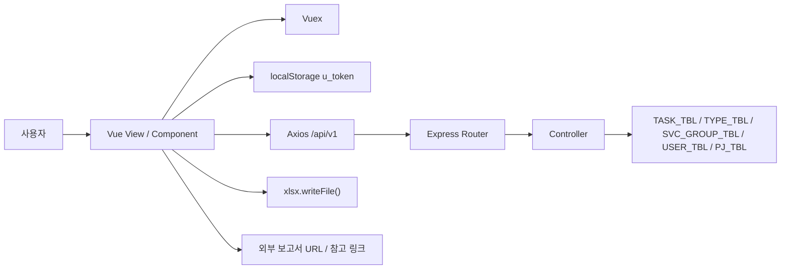

# 인터페이스 설계서

## 1. 목적

본 문서는 시스템 외부/내부 인터페이스와 데이터 계약 방식을 설명합니다.

## 2. 인터페이스 개요

이 시스템의 인터페이스는 크게 6종류입니다.

1. 브라우저 ↔ Vue View/Component
2. Vue ↔ Express JSON API
3. Express ↔ MySQL
4. 브라우저 ↔ `localStorage`
5. 브라우저 ↔ XLSX 다운로드
6. 브라우저 ↔ 외부 링크(보고서/Agit 등)

## 3. 인터페이스 맵



## 4. 프런트엔드 인터페이스

### 4.1 라우팅 계약

| 라우트 축 | 파일 | 역할 |
| --- | --- | --- |
| `/` | `DashBoard.vue` | 본인 월간 작성현황 |
| `/report/*` | `Report.vue`, `views/personal/*` | 개인 업무 입력/검색 |
| `/resource/*` | `Resource.vue`, `views/resource/*` | 리소스 집계 |
| `/search` | `views/search/Search.vue` | 전체 검색/편집 |
| `/admin/*` | `Admin.vue`, `views/admin/*` | 기준정보/멤버 관리 |
| `/profile` | `Profile.vue` | 계정 정보/비밀번호 변경 |

### 4.2 상태관리 계약

| 영역 | 저장 위치 | 주요 값 |
| --- | --- | --- |
| 사용자 공통 | root store | `member.memberId`, `member.memberLv`, `serEnv`, `fluid` |
| 개인 업무 리스트 | `stores/modules/personal.js` | `list`, `loading`, `sort` |
| 전체 검색 결과 | `stores/modules/search.js` | `list`, `condition`, `loading`, `sort` |

해석 메모:

- `admin` 모듈은 비어 있어 관리 화면도 대부분 View 내부에서 직접 API를 호출합니다.
- 즉, 현재 프런트는 `전역 상태앱`보다는 `화면별 API 직접 호출 + 일부 공통 store` 구조입니다.
- 이 중 `업무타입 관리모드`, `서비스 그룹 관리모드` CRUD 호출은 현재 코드에는 있으나 스펙아웃 항목입니다.

### 4.3 공통 컴포넌트 계약

| 컴포넌트 | 입력 | 출력/이벤트 | 용도 |
| --- | --- | --- | --- |
| `Pagination` | `current`, `start`, `end`, `final`, `range` | `loadFunc(page)` | 페이지 이동 |
| `FlashMsg` | `sendMsg(packet)` 호출 | 내부 toast 렌더링 | 플래시 메시지 |
| `TblMonthlyResourceByUser` | `targetDate`, `targetUser`, `linkMode` | 날짜 링크 이동 | 월간 작성 캘린더 |
| `TblYesterdayResource` | `targetDate` | 내부 fetch | 일간 작성현황 |

## 5. 인증 인터페이스

### 5.1 로그인 계약

- 요청: `POST /api/v1/auth/member`
- 입력: `{ userId, userPwd }`
- 출력: `{ message, u_token }`

토큰 payload에는 다음 값이 들어갑니다.

- `userId`
- `userLevel`
- `issuer`

### 5.2 보호 라우트 계약

- 프런트는 `Authorization` 헤더에 `u_token`을 그대로 넣습니다.
- 서버는 `authMiddleware`에서 JWT를 해석해 `req.decoded`를 세팅합니다.
- 관리자 판별은 대부분 `req.decoded.userLevel === 0` 여부로 처리합니다.

## 6. API 응답 계약

### 6.1 기본 응답

대부분의 컨트롤러는 아래 형식을 사용합니다.

```json
{
  "message": "success",
  "result": {}
}
```

일부 컨트롤러는 `success` boolean을 함께 사용합니다.

```json
{
  "success": true,
  "message": "OK",
  "result": {}
}
```

### 6.2 검색/리소스 특화 응답

| 기능 | 응답 특징 |
| --- | --- |
| 전체 검색 | `{ condition, list }` |
| 개인 월간 요약 | `{ day: { task_date, dd, totaltime } }` 식 nest 객체 |
| 월간 리소스 | `[typeSummary, svcSummaryByName, svcSummaryByType]` 배열 |
| 아지트 로그 | `{ meta, list }` 페이징 객체 |

## 7. 업무보고 입력 인터페이스

### 7.1 개인 입력 화면

`ReportPersonalCreate`는 `TYPE_TBL`과 `SVC_GROUP_TBL`, `PJ_TBL`에 의존해 입력 폼을 동적으로 바꿉니다.

입력 규칙:

- `type_include_svc = 0`이면 일반 업무 입력으로 처리
- `type_include_svc = 1`이면 프로젝트성 업무로 처리
- `모니터링 > 이슈탐색`은 프로젝트 검색 대신 서비스/페이지 직접입력 사용
- 그 외 프로젝트성 업무는 `POST /api/v1/aw/search/project`로 프로젝트 검색 후 선택

### 7.2 관리자 검색 화면

`Search.vue`는 개인 입력 화면보다 느슨한 raw form을 사용합니다.

- 사용자 직접 선택 가능
- 프로젝트 정보 직접 입력 가능
- 검색 결과 행을 즉시 수정/삭제 가능
- 엑셀 다운로드 가능

## 8. 리소스 집계 인터페이스

| 화면 | API | 반환 구조 |
| --- | --- | --- |
| 일간 작성현황 | `GET /api/v1/aw/admin/valid/time/:date?` | `[기준일, 사용자별 totaltime]` |
| 개인 월간 캘린더 | `GET /api/v1/aw/search/summary/:year/:month/:id` | 일자별 `totaltime` nest |
| 월간 리소스 상세 | `GET /api/v1/aw/report/resource/month/:year/:month` | type/서비스 기준 3종 집계 |
| 월간 사용자 합계 | `GET /api/v1/aw/report/resource/user/:year/:month` | 사용자별 totaltime |
| 타입별 누적 | `GET /api/v1/aw/report/resource/summary` | 연/월/type 계층 집계 |
| 서비스별 누적 | `GET /api/v1/aw/report/resource/svc` | 연/월/group/name 계층 집계 |

## 9. 파일 다운로드 인터페이스

- 서버는 `POST /api/v1/aw/xls/work`에서 workbook 데이터를 반환합니다.
- 프런트는 조건에 맞춰 파일명을 조합해 `xlsx.writeFile()`로 저장합니다.
- 즉, 브라우저가 직접 파일 바이너리를 받기보다 JS 객체를 받아 저장하는 구조입니다.

## 10. 외부 링크 인터페이스

| 대상 | 위치 | 용도 |
| --- | --- | --- |
| `pj_page_report_url` | 프로젝트 row | 보고서 원문 링크 |
| `task_pj_page_url` | 업무 row | 페이지/문서 링크 |
| Agit/Watchtower 링크 | `AdminAgitNoti.vue` | 옵션 확인 참고용(현재 스펙아웃) |

## 11. 인터페이스 해석 메모

- 이 시스템의 핵심 계약은 REST 표준보다 `현재 화면이 기대하는 JSON shape`입니다.
- 2차 개발 시 가장 먼저 고정해야 할 것은 URL 구조보다 `업무보고 저장 계약`, `리소스 집계 응답 shape`, `valid bulk update 입력 규칙`입니다.
- `TYPE_TBL`, `SVC_GROUP_TBL`의 생성/수정/삭제 UI 계약은 현재 참고용 잔존 코드로만 보고, 기본 범위에서는 제외하는 것이 맞습니다.
- 아지트 QA알리미 인터페이스는 코드에 남아 있어도 현재 범위 밖으로 분리해야 합니다.
