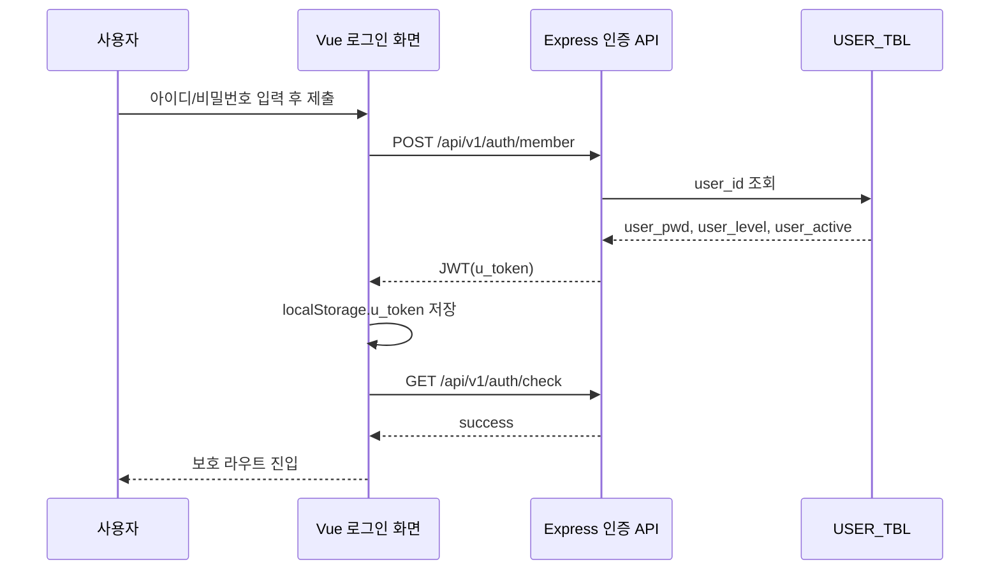
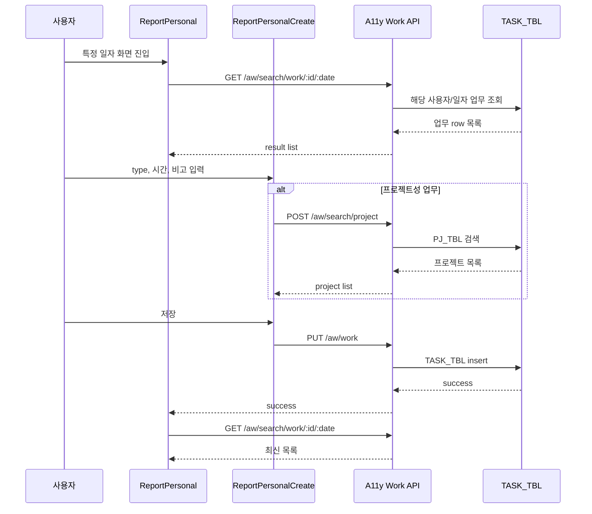
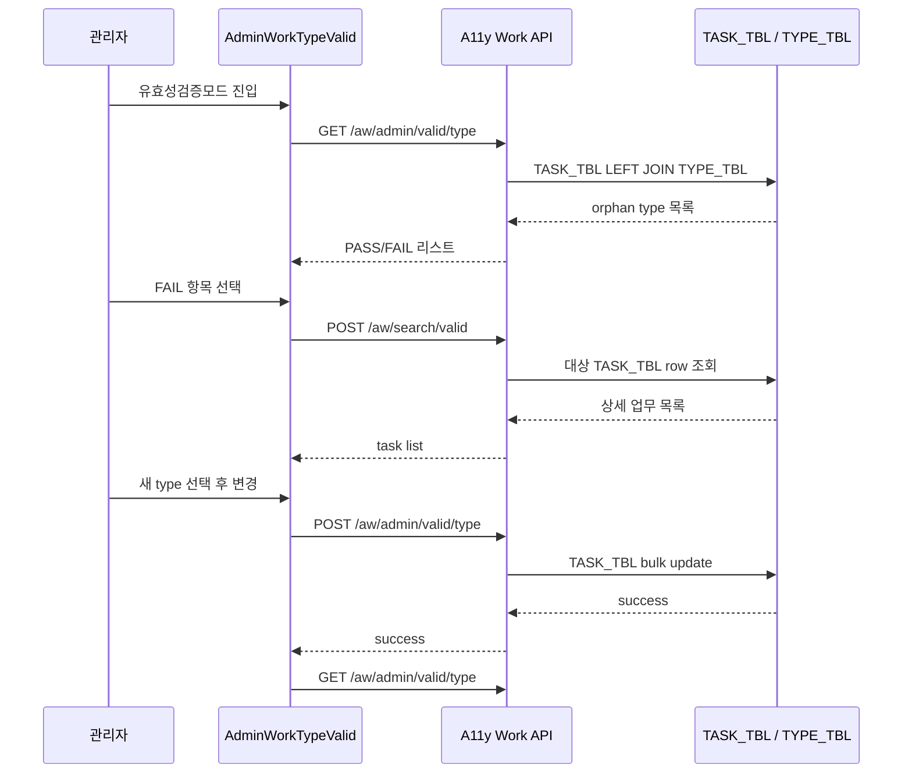
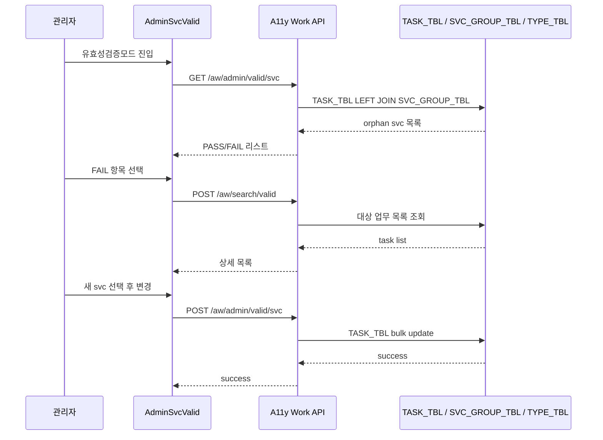
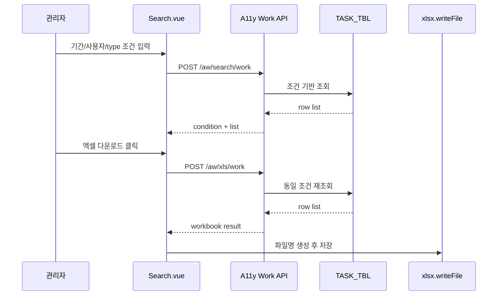
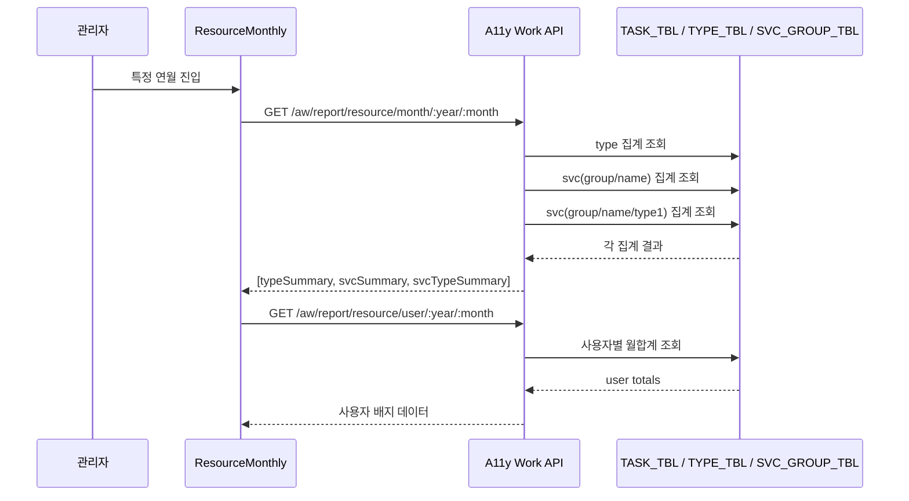

# 주요 시나리오 시퀀스 다이어그램

## 1. 로그인

## 2. 개인 업무보고 입력

## 3. 관리자 Type 유효성 검증 및 일괄 보정

## 4. 관리자 서비스 그룹 유효성 검증 및 일괄 보정

## 5. 전체 검색 후 엑셀 다운로드

## 6. 월간 리소스 상세 조회

## 7. 시퀀스 해석 메모

- 이 시스템의 중요한 시나리오는 단순 CRUD보다 `검색 -> 집계 -> 보정` 흐름에 있습니다.
- `valid` 계열 화면은 사실상 관리자용 데이터 클린업 툴입니다.
- 아지트 QA알리미는 현재 스펙아웃이므로 시퀀스 다이어그램 대상에서 제외했습니다.
