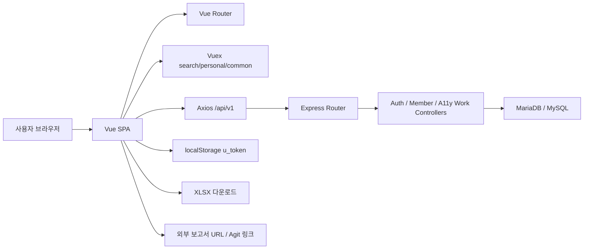

# 시스템 아키텍처 설계서

## 1. 목적

본 문서는 `linkagelab-a11y-workmanage`의 현재 구현 기준 시스템 구조, 실행 경로, 배포 형태, 구성 요소 책임을 설명합니다.

## 2. 아키텍처 요약

이 시스템은 프런트/백 분리 구조이지만, 현대적인 계층 분리 수준보다는 운영툴에 가까운 특성을 갖습니다.

- Vue 2 SPA 단일 프런트엔드
- Express 단일 API 서버
- JWT를 `localStorage`에 저장하는 간단한 인증 구조
- `mysql` 드라이버로 MariaDB/MySQL 직접 접근
- ORM, 서비스 레이어, DTO 계층 부재
- 기준정보와 업무 데이터 모두 레거시 테이블에 직접 결합

## 3. 기술 스택

| 구분 | 내용 |
| --- | --- |
| 프런트엔드 | Vue 2.6, Vue Router 3, Vuex 3, Axios, Bootstrap 4, BootstrapVue |
| 백엔드 | Node.js, Express 4, jsonwebtoken, mysql, xlsx |
| 데이터베이스 | MariaDB/MySQL (`a11y_op`, `a11y_dev`) |
| 인증 | JWT + `Authorization` 헤더 |
| 엑셀 | 서버에서 workbook 생성 후 클라이언트 `xlsx.writeFile()` |
| FE 배포 | Nginx 정적 파일 + `/api` reverse proxy |
| BE 배포 | Node 빌드 결과물(`dist/main.js`) |
| 컨테이너 | Docker multi-stage(FE), Node build(BE) |
| 오케스트레이션 | Kubernetes Deployment / Service / Ingress |

## 4. 런타임 구성도

## 5. 요청 처리 방식

### 5.1 로그인 이전

- 사용자는 `/login` 화면에서 아이디/비밀번호를 입력합니다.
- 프런트는 `POST /api/v1/auth/member`로 로그인 요청을 보냅니다.
- 서버는 `USER_TBL`을 조회해 비밀번호 해시, `user_level`, `user_active`를 확인합니다.
- 성공 시 9시간 만료 JWT를 반환합니다.
- 프런트는 `u_token`을 `localStorage`에 저장한 뒤 보호 라우트로 이동합니다.

### 5.2 로그인 이후

- 각 보호 라우트는 `requireAuth` 가드에서 토큰 존재 여부와 `GET /api/v1/auth/check` 결과를 확인합니다.
- 상단 네비게이션은 토큰 payload의 `userId`, `userLevel`을 Vuex에 적재해 렌더링합니다.
- 대부분의 View는 `mounted` 또는 `created`에서 API를 직접 호출해 데이터를 채웁니다.

### 5.3 데이터 처리

- 업무보고, 검색, 리소스, 관리자 화면은 모두 `front/src/apis/index.js`를 통해 JSON API를 호출합니다.
- 서버는 `server/controllers/api_a11y_work_controller.js`와 관련 컨트롤러에서 SQL을 직접 작성합니다.
- 응답 포맷은 대체로 다음 두 형태입니다.
  - `{ message, result }`
  - `{ success, message, result }`
- 인증 API만 `{ message, u_token }` 형태를 반환합니다.

## 6. 코드 레이어 책임

| 레이어 | 주요 파일 | 책임 |
| --- | --- | --- |
| 인증 | `front/src/utils/auth.js`, `server/controllers/api_auth_controller.js`, `server/middlewares/auth.js` | JWT 발급/검증, 라우트 가드 |
| 셸/레이아웃 | `front/src/App.vue`, `front/src/components/AppNav.vue`, `front/src/components/SkipNav.vue` | 공통 레이아웃, 상단 네비게이션, 접근성 보조 |
| 화면(View) | `front/src/views/*` | 화면 단위 데이터 로딩, 탭/필터/다운로드 UX |
| 화면 컴포넌트 | `front/src/components/*` | 표 row, 폼, 페이징, 리소스 보조 컴포넌트 |
| 상태관리 | `front/src/stores/*` | 공통 사용자 정보, 검색 결과, 개인 업무 리스트 |
| API 라우팅 | `server/routes/index.js`, `server/routes/a11y_work_route.js` | 엔드포인트 그룹화 |
| 업무 로직 | `server/controllers/api_a11y_work_controller.js` | 업무보고, 검색, 리소스, 마스터 CRUD, 프로젝트 |
| 기준정보/멤버 | `server/controllers/api_member_controller.js` | 사용자 CRUD/비밀번호 |
| 배포 | `Dockerfile*`, `nginx/*.conf`, `k8s/*.yaml` | 빌드/호스팅/배포 |

## 7. 주요 화면 도메인

| 도메인 | 대표 화면 | 주요 테이블 |
| --- | --- | --- |
| 인증/프로필 | 로그인, 프로필/비밀번호 변경 | `USER_TBL` |
| 업무보고 | 개인 업무 입력/수정/삭제, 개인 기간 검색 | `TASK_TBL`, `TYPE_TBL`, `SVC_GROUP_TBL`, `PJ_TBL` |
| 전체 검색 | 관리자 검색, 인라인 수정/삭제, 엑셀 다운로드 | `TASK_TBL`, `TYPE_TBL`, `SVC_GROUP_TBL`, `USER_TBL` |
| 리소스 집계 | 일간 작성현황, 월간 MM, 타입/서비스 요약 | `TASK_TBL`, `TYPE_TBL`, `SVC_GROUP_TBL`, `USER_TBL` |
| 사용자 관리 | 사용자 목록, 생성, 수정, 비밀번호 초기화 | `USER_TBL` |
| 정합성 보정 | type/svc validation 후 bulk update | `TASK_TBL`, `TYPE_TBL`, `SVC_GROUP_TBL` |
| 기준정보 CRUD(스펙아웃) | 업무 타입/서비스 그룹 생성·수정·삭제 | `TYPE_TBL`, `SVC_GROUP_TBL` |
| 프로젝트(비활성) | 프로젝트 목록/생성/삭제 | `PJ_TBL` |
| 아지트 알리미(스펙아웃) | 로그/옵션 | `AGITNOTI_TBL`, `AGITNOTI_OPT_TBL` |

## 8. 배포 아키텍처

### 8.1 프런트

- Nginx가 정적 파일을 `/usr/share/nginx/html`에서 서빙합니다.
- dev FE는 `8093`, cbt FE는 `8091` 포트를 사용합니다.
- `/api` 경로는 각각 `a11y-work-be-dev.devel.kakao.com/api`, `a11y-work-be.devel.kakao.com/api`로 프록시합니다.

### 8.2 백엔드

- Node build 결과물을 `node ./dist/main.js`로 실행합니다.
- dev BE는 `8092`, cbt/prod BE는 `8090` 포트를 사용합니다.
- DB 연결 정보와 JWT secret은 소스 코드 `config.js`에 하드코딩되어 있습니다.

### 8.3 Kubernetes

- dev/cbt FE/BE 각각 별도 Deployment와 Service를 가집니다.
- Ingress host 기준으로 FE/BE를 분리 노출합니다.
- 동일 저장소 이미지명을 재사용하는 구조라 빌드/태깅 규칙에 의존합니다.

## 9. 외부 의존성

| 대상 | 방식 | 용도 |
| --- | --- | --- |
| MySQL/MariaDB | `mysql.createConnection()` | 인증, 업무, 리소스, 마스터 데이터 저장/조회 |
| 브라우저 `localStorage` | 토큰 저장 | 인증 상태 유지 |
| `xlsx` | 서버/클라이언트 양쪽 사용 | 검색 결과 엑셀 다운로드 |
| 외부 보고서 URL | 새 창 이동 | 프로젝트 보고서 원문 참조 |
| Agit / 와치타워 링크 | 링크 이동 | 알리미 설정 참고(현재 스펙아웃) |

## 10. 현재 구조의 특징

### 10.1 장점

- 화면과 API가 분리되어 PHP 버전보다 구조 추적이 단순합니다.
- 관리자 관점의 검색/보정/집계 기능이 화면별로 명확히 나뉘어 있습니다.
- `TASK_TBL` 기반 집계 로직이 한 컨트롤러에 모여 있어 도메인 파악이 빠릅니다.

### 10.2 제약

- SQL 문자열 결합과 하드코딩이 많아 보안/변경 리스크가 큽니다.
- 화면 권한, 라우트 권한, 서버 권한이 완전히 일치하지 않습니다.
- 리소스 집계와 기준정보 validation이 모두 `TASK_TBL` 오염 상태에 직접 영향을 받습니다.
- 프로젝트/아지트처럼 중간에 멈춘 기능이 코드에 남아 있어 실제 범위 판단이 필요합니다.

## 11. 설계 판단 메모

- 이 저장소는 `새로운 제품`이라기보다 `운영 데이터 보정 + 조회 + 집계 + 입력 도구`로 이해하는 것이 정확합니다.
- 2차 개발에서 가장 먼저 정리해야 할 축은 `업무보고 저장 계약`, `기준정보 마스터`, `리소스 집계 기준`, `관리자 검색/엑셀`입니다.
- 아지트 QA알리미는 현재 구조 설명에서는 참고 대상이지만, 개발 범위에서는 제외해야 합니다.
