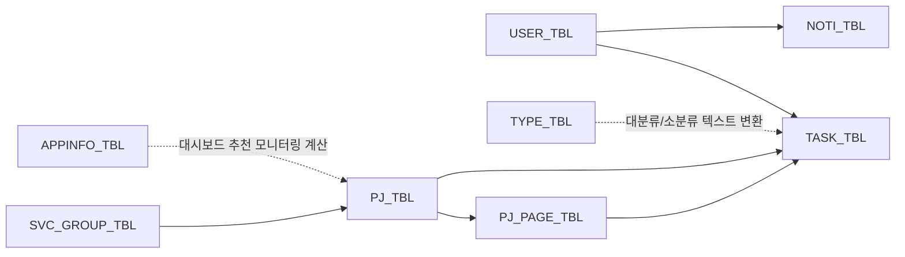

# 데이터베이스 설계서

## 1. 전제

이 문서는 루트의 개발서버 덤프 [`db_a11yop_2512041025.sql`](../../db_a11yop_2512041025.sql)과 코드에서 사용한 SQL을 함께 대조해 작성한 스키마 문서입니다.

- 실제 테이블 구조는 SQL 덤프를 우선 기준으로 사용했습니다.
- 컬럼의 업무 의미와 관계 해석은 코드 사용 패턴을 기준으로 보완했습니다.
- 날짜 컬럼은 `DATE`가 아니라 문자열/숫자형으로 저장되는 흔적이 섞여 있습니다.

## 2. ER 개요

## 3. 테이블 요약

| 테이블 | 역할 |
| --- | --- |
| `USER_TBL` | 사용자 계정, 권한, 활성 상태, 생성일 |
| `TYPE_TBL` | 업무 분류 대분류/소분류 |
| `SVC_GROUP_TBL` | 서비스 그룹/서비스명 기준정보 |
| `PJ_TBL` | 프로젝트 마스터 |
| `PJ_PAGE_TBL` | 프로젝트별 페이지/트래킹 단위 |
| `TASK_TBL` | 업무보고 이력 |
| `APPINFO_TBL` | 앱 운영 상태 기준정보, 대시보드 추천 모니터링 보조 소스 |
| `NOTI_TBL` | 공지/질문 저장 |

## 3.1 SQL 덤프 기준 실제 테이블 비교

루트의 [`db_a11yop_2512041025.sql`](../../db_a11yop_2512041025.sql) 기준으로 확인한 실제 테이블은 다음 9개입니다.

- `AGITNOTI_OPT_TBL`
- `AGITNOTI_TBL`
- `APPINFO_TBL`
- `PJ_PAGE_TBL`
- `PJ_TBL`
- `SVC_GROUP_TBL`
- `TASK_TBL`
- `TYPE_TBL`
- `USER_TBL`

코드 참조 테이블과 비교하면 아래와 같습니다.

| 구분 | 테이블 | 해석 |
| --- | --- | --- |
| 코드와 덤프 모두 존재 | `APPINFO_TBL`, `PJ_PAGE_TBL`, `PJ_TBL`, `SVC_GROUP_TBL`, `TASK_TBL`, `TYPE_TBL`, `USER_TBL` | 현재 코드와 스키마가 일치하는 운영 후보 테이블 |
| 덤프에만 존재 | `AGITNOTI_TBL`, `AGITNOTI_OPT_TBL` | 이 저장소 코드에서는 직접 참조되지 않음. 미사용이거나 외부/이전 기능용 후보 |
| 코드에만 존재 | `NOTI_TBL` | 현재 코드의 알림 기능이 레거시 잔존이거나, 실제 DB 구조와 불일치할 가능성 |

즉, SQL 덤프 기준으로 보면 `AGITNOTI_TBL`, `AGITNOTI_OPT_TBL`은 이 저장소 기준 미사용 후보이며, 반대로 `NOTI_TBL`은 코드가 참조하지만 실제 덤프에는 보이지 않습니다.

추가 해석:

- `APPINFO_TBL`은 코드와 덤프 모두 존재하지만, `TASK_TBL`이나 `PJ_TBL`처럼 핵심 업무 이력의 중심축은 아닙니다.
- 실제 코드상 역할은 `pages/appinfo.php` 관리 화면과 `dbcon/recommandmoni.php`의 대시보드 추천 모니터링 계산으로 제한됩니다.
- 따라서 `APPINFO_TBL`은 "현재도 일부 참조되지만, 레거시 보조 기준정보일 가능성이 높은 테이블"로 보는 것이 가장 정확합니다.

## 4. 테이블 상세

### 4.1 USER_TBL

| 컬럼 | 추정 | 설명 |
| --- | --- | --- |
| `user_num` | PK, int | 사용자 내부 번호 |
| `user_id` | unique, varchar | 로그인 ID |
| `user_pwd` | varchar | SHA-256 후 base64 인코딩된 비밀번호 |
| `user_name` | varchar | 사용자 이름 |
| `user_level` | varchar/int | 권한, `1=관리자`, 그 외 일반 |
| `user_active` | varchar/int | 활성 여부, `1=활성`, `0=비활성` |
| `user_birth` | varchar/date | 생일, 계정관리 화면에서만 표시 |
| `user_create` | varchar/date | 계정 생성일, 미입력 시간 계산에 사용 |

주요 사용처:

- 로그인 검증
- 멤버 목록
- 비밀번호 변경
- 전체 등록 대상 사용자 조회

### 4.2 TYPE_TBL

| 컬럼 | 추정 | 설명 |
| --- | --- | --- |
| `type_num` | PK, int | 업무 분류 번호 |
| `type_one` | varchar | 대분류 |
| `type_two` | varchar | 소분류 |
| `type_etc` | varchar/text | 비고 |
| `type_active` | tinyint | 활성 여부 |

주요 특징:

- `TASK_TBL.task_type2`는 `type_num`이 아니라 `type_two` 텍스트를 저장합니다.
- 프런트엔드 [`webapp/js/category.js`](../../webapp/js/category.js)에서 일부 `type_num` 값별로 입력 폼이 달라집니다.

### 4.3 SVC_GROUP_TBL

| 컬럼 | 추정 | 설명 |
| --- | --- | --- |
| `svc_num` | PK, int | 서비스 기준번호 |
| `svc_group` | varchar | 서비스 그룹명 |
| `svc_name` | varchar | 서비스명 |

주요 특징:

- 프로젝트 등록/수정 시 선택값을 `PJ_TBL`에 복제 저장합니다.
- 업무보고 등록 시에도 서비스 그룹/명을 텍스트로 저장합니다.

### 4.4 PJ_TBL

| 컬럼 | 추정 | 설명 |
| --- | --- | --- |
| `pj_num` | PK, int | 프로젝트 번호 |
| `pj_group_type1` | varchar | 프로젝트 유형, 예: QA, 모니터링 |
| `pj_platform` | varchar | 플랫폼 |
| `pj_sev_group` | varchar | 서비스 그룹명 |
| `pj_sev_name` | varchar | 서비스명 |
| `pj_name` | varchar | 프로젝트명 |
| `pj_page_report_url` | varchar/text | 보고서 URL |
| `pj_reporter` | varchar | 리포터 ID 또는 이름 |
| `pj_reviewer` | varchar | 리뷰어 ID 또는 이름 |
| `pj_start_date` | varchar/date | 시작일 |
| `pj_end_date` | varchar/date | 종료일 |

주요 특징:

- 프로젝트 수정 시 `TASK_TBL`의 관련 업무기록까지 일괄 갱신합니다.
- 모니터링 페이지 추가 또는 트래킹 저장 시 `pj_end_date`가 자동 갱신됩니다.

### 4.5 PJ_PAGE_TBL

| 컬럼 | 추정 | 설명 |
| --- | --- | --- |
| `pj_page_num` | PK, int | 프로젝트 페이지 번호 |
| `pj_unique_num` | FK, int | 상위 프로젝트 번호 (`PJ_TBL.pj_num`) |
| `pj_page_name` | varchar | 페이지명 또는 점검 대상명 |
| `pj_page_url` | varchar/text | 페이지 URL |
| `pj_page_id` | varchar | 담당 사용자 ID |
| `pj_page_creat` | varchar/date | 생성일 |
| `pj_page_date` | varchar | 모니터링 기준 월(`ym`) 또는 기준일 성격 |
| `pj_page_track_end` | varchar/int | 개선 상태, `0=미개선`, `1=개선`, `2=일부`, `3=중지` |
| `pj_page_agit` | varchar/date | 아지트 공유일 |
| `pj_page_agit_url` | varchar/text | 아지트 URL |
| `pj_page_track1` | varchar/date | 1차 점검일 |
| `pj_page_track2` | varchar/date | 2차 점검일 |
| `pj_page_track3` | varchar/date | 3차 점검일 |
| `pj_page_track4` | varchar/date | 4차 점검일 |
| `pj_page_highest` | int | 수정된 highest 이슈 수 |
| `pj_page_high` | int | 수정된 high 이슈 수 |
| `pj_page_normal` | int | 수정된 normal 이슈 수 |
| `pj_page_report` | int/date | 보고 일수 또는 보고 횟수 추정 |
| `pj_page_track_etc` | text | 비고 |

주요 특징:

- QA 프로젝트보다 모니터링 트래킹용으로 더 강하게 사용됩니다.
- 페이지 수정 시 연결된 `TASK_TBL.task_pj_page`, `task_pj_page_url`이 함께 수정됩니다.

### 4.6 TASK_TBL

| 컬럼 | 추정 | 설명 |
| --- | --- | --- |
| `task_num` | PK, int | 업무보고 번호 |
| `task_date` | varchar/date | 업무 일자 |
| `task_user` | FK 성격, varchar | 사용자 ID |
| `task_type1` | varchar | 대분류 |
| `task_type2` | varchar | 소분류 텍스트 |
| `task_platform` | varchar | 플랫폼 |
| `task_svc_group` | varchar | 서비스 그룹명 |
| `task_svc_name` | varchar | 서비스명 |
| `task_pj_name` | varchar | 프로젝트명 텍스트 |
| `task_pj_page` | varchar/text | 페이지명 또는 상세 내용 |
| `task_pj_page_url` | varchar/text | URL |
| `task_manager` | varchar | 담당자/관리자 필드, 현재 활성 화면 사용은 약함 |
| `task_usedtime` | int | 사용 시간(분) |
| `task_etc` | text | 비고 |
| `task_allcount` | tinyint | 전체 등록 여부 |
| `task_pj_report_num` | FK 성격, int | 프로젝트 번호 복제 |
| `task_page_report_num` | FK 성격, int | 프로젝트 페이지 번호 복제 |
| `task_count_element` | int | 레거시 QA 세부 필드 |
| `task_count_error` | int | 레거시 QA 세부 필드 |
| `task_count_errortask` | int | 레거시 QA 세부 필드 |
| `task_estimated` | int | 레거시 QA 세부 필드 |
| `task_test_report` | int | 레거시 QA 세부 필드 |
| `task_communication` | int | 레거시 QA 세부 필드 |
| `task_review` | int | 레거시 QA 세부 필드 |

주요 특징:

- 가장 중요한 이력 테이블입니다.
- 정규화보다 조회 편의 위주로 설계되어 프로젝트명, 페이지명, 서비스명 등을 모두 복제 저장합니다.
- 일부 행은 전체 등록(`task_allcount=1`)로 여러 사용자에게 일괄 생성됩니다.

### 4.7 APPINFO_TBL

| 컬럼 | 추정 | 설명 |
| --- | --- | --- |
| `appinfo_num` | PK, int | 앱 정보 번호 |
| `appinfo_plat` | varchar | `iOS`, `And` |
| `appinfo_name` | varchar | 앱 이름 |
| `appinfo_info` | varchar | 운영 상태, 예: `운영중`, `최소운영`, `미운영` |
| `appinfo_date` | varchar/date | 최종 수정일 |
| `appinfo_etc` | text | 비고 |

주요 특징:

- 메뉴 `기타 > 앱 운영정보` 화면에서 조회/수정/등록 대상으로 남아 있습니다.
- Dashboard 추천 모니터링 후보 계산에 사용됩니다.
- 업무보고 등록, 프로젝트 등록, 통계 집계의 핵심 조인 축으로는 사용되지 않습니다.
- 덤프 데이터의 수정일이 2016~2017년에 몰려 있고 일부만 2023년이라, 현행 운영 마스터라기보다 오래된 기준정보가 잔존했을 가능성이 높습니다.

### 4.8 NOTI_TBL

| 컬럼 | 추정 | 설명 |
| --- | --- | --- |
| `noti_num` | PK, int | 알림 번호 |
| `noti_user` | varchar | 작성자 ID |
| `noti_check` | tinyint | 확인 여부 추정 |
| `title` | varchar/text | 공지/질문 본문 |
| `noti_date` | datetime | 생성 일시 |

주요 특징:

- 최근 4건 조회만 확인됩니다.
- 클라이언트에는 Notification API/EventSource 연동 흔적이 있으나 서버의 실시간 push 구현 파일은 저장소에 없습니다.

## 5. 관계 상세

| 출발 | 도착 | 관계 | 비고 |
| --- | --- | --- | --- |
| `USER_TBL.user_id` | `TASK_TBL.task_user` | 1:N | 업무 작성자 |
| `USER_TBL.user_id` | `PJ_PAGE_TBL.pj_page_id` | 1:N | 트래킹 담당자 |
| `SVC_GROUP_TBL` | `PJ_TBL` | 1:N | 프로젝트에 서비스 그룹/명 복제 |
| `PJ_TBL.pj_num` | `PJ_PAGE_TBL.pj_unique_num` | 1:N | 프로젝트-페이지 |
| `PJ_TBL.pj_num` | `TASK_TBL.task_pj_report_num` | 1:N | 일부 업무 이력에서만 사용 |
| `PJ_PAGE_TBL.pj_page_num` | `TASK_TBL.task_page_report_num` | 1:N | 일부 업무 이력에서만 사용 |
| `TYPE_TBL.type_two` | `TASK_TBL.task_type2` | 논리 참조 | ID가 아닌 텍스트 저장 |

## 6. 데이터 무결성 특이사항

1. `TASK_TBL.task_type2`는 `TYPE_TBL.type_num`이 아니라 `type_two` 텍스트를 저장합니다.
2. `TASK_TBL.task_pj_name`, `task_pj_page`는 텍스트 복제본이라 프로젝트명/페이지명 변경 시 이력 수정이 필요합니다.
3. 프로젝트 수정(`pj_edit.php`)과 페이지 수정(`pj_page_edit.php`)은 실제로 과거 업무 이력까지 업데이트합니다.
4. 날짜 포맷이 `Y-m-d`, `ymd`, `ym`으로 혼재합니다.
5. 외래키 제약이 코드상 보이지 않으므로 삭제 시 참조 무결성은 애플리케이션 로직에 의존합니다.

## 7. 설계 해석

- 이 DB는 분석/집계 및 운영 편의에 맞춘 "복제 저장형 운영 DB"에 가깝습니다.
- 정규화보다 화면 조회와 엑셀/HTML 다운로드 편의가 우선된 구조입니다.
- 문서화와 유지보수 시에는 "정합성 보장 위치가 DB가 아니라 PHP 파일"이라는 점을 항상 전제로 봐야 합니다.
