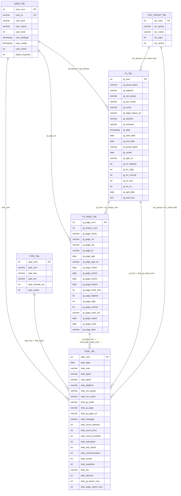
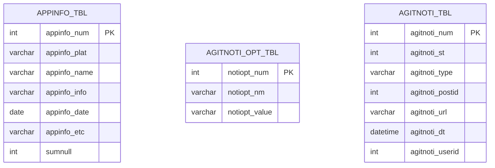

# ERD

## 1. 작성 기준

- 기준 소스: 루트 SQL 덤프 [`db_a11yop_2512041025.sql`](../../db_a11yop_2512041025.sql)
- 보조 근거: `webapp/dbcon/*.php`, `webapp/pages/*.php`, `webapp/js/*.js`
- 주의: 실제 DB에는 외래키 제약조건이 거의 없습니다.
- 따라서 아래 ERD는 `물리 PK/UK`와 `코드상 논리 참조`를 함께 표시한 As-Is 모델입니다.

## 2. 핵심 운영 ERD

## 3. 보조/레거시 ERD

## 4. 관계 해설

| 관계 | 성격 | 설명 |
| --- | --- | --- |
| `PJ_TBL.pj_num -> PJ_PAGE_TBL.pj_unique_num` | 사실상 부모-자식 | 저장소와 덤프 모두에서 가장 명확한 핵심 관계 |
| `PJ_TBL.pj_num -> TASK_TBL.task_pj_report_num` | 부분 논리 FK | 일부 업무기록만 프로젝트 번호를 채웁니다 |
| `PJ_PAGE_TBL.pj_page_num -> TASK_TBL.task_page_report_num` | 부분 논리 FK | 일부 업무기록만 페이지 번호를 채웁니다 |
| `USER_TBL.user_id -> TASK_TBL.task_user` | 논리 FK | 작성자 ID 매핑 |
| `USER_TBL.user_id -> PJ_PAGE_TBL.pj_page_id` | 논리 FK | 페이지 담당자 ID 매핑 |
| `USER_TBL.user_id -> PJ_TBL.pj_reporter/pj_reviewer` | 텍스트 참조 | 담당자/리뷰어를 문자열로 저장합니다 |
| `TYPE_TBL.type_two -> TASK_TBL.task_type2` | 텍스트 참조 | 타입 번호가 아니라 타입명을 저장합니다 |
| `SVC_GROUP_TBL -> PJ_TBL/TASK_TBL` | 텍스트 복제 | 서비스 그룹/서비스명을 숫자 FK가 아니라 문자열로 복제합니다 |
| `APPINFO_TBL -> PJ_TBL` | 비정규 참조 | 대시보드 추천 모니터링에서 `appinfo_name`과 `SUBSTRING_INDEX(pj_name, ' ', 1)`를 비교합니다 |

## 5. 해석 포인트

1. 이 시스템의 실질적인 중심은 `TASK_TBL`입니다.
2. `PJ_TBL`과 `PJ_PAGE_TBL`은 프로젝트 마스터와 트래킹 단위를 구성하지만, 과거 이력은 텍스트 복제 저장 때문에 완전 정규화돼 있지 않습니다.
3. `TYPE_TBL`, `SVC_GROUP_TBL`은 참조 마스터처럼 보이지만 실제 저장은 텍스트 복제 방식이라 무결성이 코드에 의존합니다.
4. `APPINFO_TBL`은 완전 미사용은 아니나 핵심 운영 ERD보다 보조 ERD에 두는 편이 맞습니다.
5. `AGITNOTI_TBL`, `AGITNOTI_OPT_TBL`은 덤프에는 존재하지만 현재 저장소 코드에서는 직접 참조되지 않습니다.
