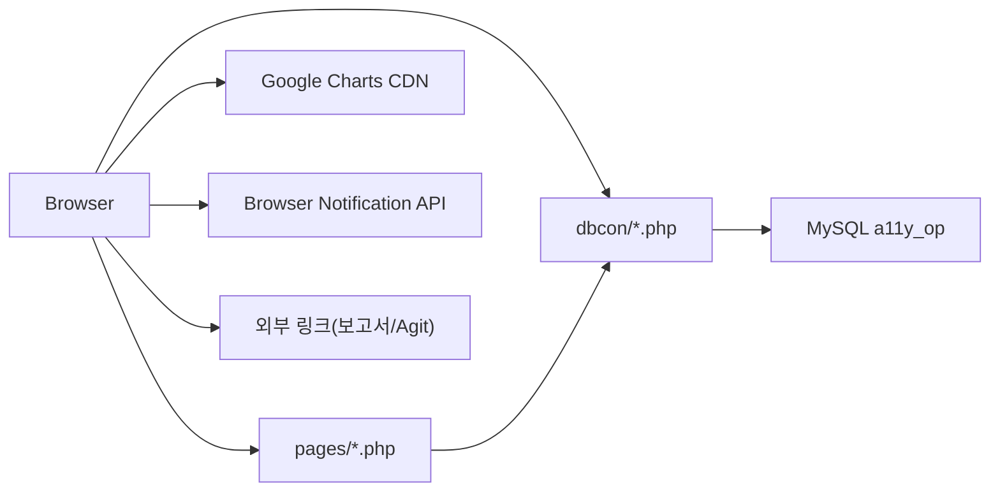

# 인터페이스 설계서

## 1. 목적

본 문서는 시스템 외부/내부 인터페이스와 데이터 계약 방식을 설명합니다.

## 2. 인터페이스 개요

이 시스템의 인터페이스는 크게 4종류입니다.

1. 브라우저 ↔ PHP View (`pages/*.php`)
2. 브라우저 ↔ PHP Fragment API (`dbcon/*.php`)
3. PHP ↔ MySQL
4. 브라우저 ↔ 외부 서비스/브라우저 API

## 3. 인터페이스 맵

## 4. 내부 인터페이스

### 4.1 화면 전환 인터페이스

| 호출 주체 | 대상 | 방식 | 계약 |
| --- | --- | --- | --- |
| `link.js` | `pages/*.php` | `$('#page-wrapper').load()` | 전체 화면 fragment HTML |
| `index.php` | `pages/dashboard.php` | PHP include | 초기 화면 렌더링 |

### 4.2 Fragment API 인터페이스

| 패턴 | 예시 엔드포인트 | 소비 방식 |
| --- | --- | --- |
| 테이블 행 반환 | `day_report_list.php`, `track_list.php` | `.html()`로 `<tbody>` 교체 |
| 셀 편집 UI 반환 | `report_edit_select.php`, `track_edit_select.php` | 특정 셀 `.html()` 교체 |
| 셀렉트 옵션 반환 | `type_type1.php`, `type_type2.php`, `pj_page_tran.php` | `<select>` 내부 추가/교체 |
| 단일 문자열 반환 | `pj_sv_tran.php`, `search_date_check.php` | `.val()` 또는 `.text()` 세팅 |
| 스크립트 반환 | `pj_add.php`, `pj_edit.php`, `id_insert.php` | alert 후 화면 재로딩 |
| 파일 반환 | `report_search_export.php` | `window.open()` |

### 4.3 DB 인터페이스

| 항목 | 내용 |
| --- | --- |
| 연결 함수 | `mysqli_connect()` |
| 호스트 | `10.202.45.203` |
| DB명 | `a11y_op` |
| 문자셋 | `utf8mb4` |
| 공통 파일 | `dbcon/connect.php` |

## 5. 외부 인터페이스

### 5.1 Google Charts

| 항목 | 내용 |
| --- | --- |
| 사용 화면 | `stati_qa.php`, `stati_mo.php` |
| 방식 | `https://www.gstatic.com/charts/loader.js` 로드 |
| 계약 | PHP가 차트용 JS 배열 문자열 생성 |

### 5.2 외부 문서/협업 링크

| 항목 | 내용 |
| --- | --- |
| 보고서 URL | `PJ_TBL.pj_page_report_url`, `TASK_TBL.task_pj_page_url` |
| Agit URL | `PJ_PAGE_TBL.pj_page_agit_url` |
| 사용 방식 | `<a target="_blank">` |

### 5.3 브라우저 Notification API

| 항목 | 내용 |
| --- | --- |
| 관련 파일 | `head.php`, `js/noti.js`, `dbcon/noticontrol.php`, `dbcon/noti_select.php` |
| 상태 | 클라이언트 호출 흔적은 있으나 실시간 서버 엔드포인트 `noti.php`는 저장소에서 확인되지 않음 |

## 6. 주요 데이터 계약

### 6.1 업무보고 리스트 계약

| 요청 | 응답 |
| --- | --- |
| `GET day_report_list.php?date=...&ecount=...` | `<tbody>`에 바로 삽입 가능한 `<tr>` 목록 |

응답 행에 포함되는 UI:

- 수정 버튼 `.report_edit_btn`
- 삭제 버튼 `#report_del_btn`
- 각 셀 식별 클래스 `.type1{task_num}`, `.type2{task_num}`, `.time{task_num}`, `.etc{task_num}`

### 6.2 트래킹 편집 계약

| 요청 | 응답 |
| --- | --- |
| `POST track_edit_select.php` + `ecount=0..12` | 특정 셀에 들어갈 `<input>`, `<select>`, `<button>` |

특징:

- 한 행을 편집 상태로 바꾸기 위해 동일 엔드포인트를 13회 호출합니다.
- 편집 결과는 `track_edit_save.php`에 한 번에 제출합니다.

### 6.3 프로젝트 수정 계약

| 요청 | 응답 |
| --- | --- |
| `POST pj_page.php` | 프로젝트 수정 폼 전체 fragment |
| `POST pj_page_select.php` | 페이지 목록 `<li>` 묶음 |
| `POST pj_edit.php` | alert + `project.php` 재로딩 스크립트 |

### 6.4 앱 운영정보 계약

| 요청 | 응답 |
| --- | --- |
| `POST list_appinfo_edit_select.php` | 행 일부 셀 편집용 fragment |
| `POST list_appinfo_edit_save.php` | 별도 JSON 없이 성공 후 프런트에서 전체 화면 재로딩 |

## 7. 인터페이스 설계상 특징

1. 인터페이스 표준화가 약합니다.
2. 같은 도메인에서도 일부는 `GET`, 일부는 `POST`, 일부는 PHP include입니다.
3. 프런트엔드가 서버 응답 구조를 DOM 단위로 강하게 가정합니다.
4. 서버는 상태 코드/에러 객체보다 alert 스크립트에 의존합니다.

## 8. 개선 시 고려사항

| 우선순위 | 제안 |
| --- | --- |
| 높음 | HTML fragment 응답을 JSON + 템플릿 렌더링으로 분리 |
| 높음 | 날짜/식별자 계약 표준화 |
| 중간 | 성공/실패 응답 포맷 통일 |
| 중간 | 외부 인터페이스(`Google Charts`, `Notification`) 의존성 명시화 |
| 중간 | 숨김/미사용 인터페이스 정리 |
