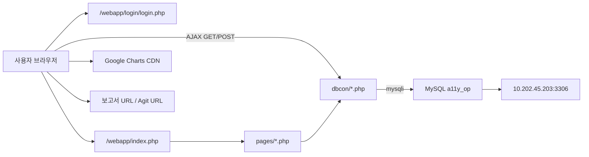

# 시스템 아키텍처 설계서

## 1. 목적

본 문서는 `php-operation_tool`의 현재 구현 기준 시스템 구조, 실행 경로, 배포 형태, 구성 요소 책임을 설명합니다.

## 2. 아키텍처 요약

이 시스템은 전형적인 3계층 MVC 구조가 아니라, 다음 특성을 갖는 레거시 운영툴입니다.

- 단일 PHP 셸(`index.php`) 기반
- jQuery `load()`로 화면 조각(`pages/*.php`) 교체
- 서버 측 엔드포인트(`dbcon/*.php`)가 HTML 조각 또는 스크립트 응답 반환
- `mysqli`로 MySQL 직접 접근
- 프레임워크, ORM, 라우터, DI 컨테이너, 템플릿 엔진 부재

## 3. 기술 스택

| 구분 | 내용 |
| --- | --- |
| 런타임 | PHP 7.1 + Apache |
| 프런트엔드 | HTML, jQuery, jQuery UI, Foundation 일부, Google Charts |
| 서버 렌더링 | PHP include 기반 |
| 데이터 접근 | `mysqli_*`, SQL 문자열 직접 작성 |
| 배포 단위 | Docker 컨테이너 |
| 오케스트레이션 | Kubernetes Deployment |
| 포트 | Apache `8081` |
| 데이터베이스 | MySQL `a11y_op` |

## 4. 런타임 구성도

## 5. 요청 처리 방식

### 5.1 로그인 이전

- 사용자는 [`webapp/login/login.php`](../../webapp/login/login.php)에서 `id`, `pw`를 입력합니다.
- 로그인 폼은 [`webapp/login/user_check.php`](../../webapp/login/user_check.php)로 POST 됩니다.
- `user_check.php`는 `USER_TBL`을 조회해 아이디, 비밀번호, 활성 여부를 확인합니다.
- 성공 시 세션(`user_id`, `user_name`, `user_level`)을 저장하고 `../index.php`로 이동합니다.

### 5.2 로그인 이후

- [`webapp/index.php`](../../webapp/index.php)는 세션 검사 파일 [`webapp/user_section.php`](../../webapp/user_section.php)를 include 합니다.
- 공통 헤더 [`webapp/head.php`](../../webapp/head.php), 메뉴 [`webapp/nav.php`](../../webapp/nav.php), 기본 페이지 [`webapp/pages/dashboard.php`](../../webapp/pages/dashboard.php)를 로드합니다.
- 좌측 메뉴 클릭 시 [`webapp/js/link.js`](../../webapp/js/link.js)가 `#page-wrapper` 영역에 `pages/*.php`를 주입합니다.

### 5.3 부분 갱신

- 대부분의 조회/저장/수정/삭제는 `$.ajax()` 또는 `$('#page-wrapper').load()`로 수행됩니다.
- 공통 AJAX 유틸은 [`webapp/js/ajax.js`](../../webapp/js/ajax.js)에 있으며, 응답을 `.html()`, `.text()`, `.val()`로 바로 삽입합니다.
- 서버 응답 형식은 JSON이 아니라 다음 중 하나입니다.
  - 테이블 행(`<tr>...</tr>`)
  - `<option>` 목록
  - `<input>` 또는 `<select>` fragment
  - ``
  - 다운로드용 HTML 파일

## 6. 코드 레이어 책임

| 레이어 | 주요 파일 | 책임 |
| --- | --- | --- |
| 인증 | `login/*.php`, `user_section.php` | 로그인, 로그아웃, 세션 검사 |
| 셸/레이아웃 | `index.php`, `head.php`, `nav.php` | 공통 레이아웃, 이벤트 바인딩 |
| 화면(View) | `pages/*.php` | 화면 구성, 일부 인라인 JS |
| 화면 제어 | `js/*.js` | 메뉴 전환, 입력 폼 동적 조합, AJAX 호출 |
| 서버 엔드포인트 | `dbcon/*.php` | DB 조회/수정, HTML fragment 생성 |
| 데이터 접근 | `dbcon/connect.php` | MySQL 연결, charset 설정 |
| 배포 | `Dockerfile`, `apache/*`, `k8s/deployment.yaml` | 컨테이너/포트/리소스 설정 |

## 7. 주요 화면 도메인

| 도메인 | 대표 화면 | 주요 테이블 |
| --- | --- | --- |
| 인증 | 로그인, 로그아웃, 비밀번호 변경 | `USER_TBL` |
| 업무보고 | 업무 입력, 일별 리스트, 개인 검색, 전체 검색 | `TASK_TBL`, `TYPE_TBL`, `PJ_TBL`, `PJ_PAGE_TBL` |
| 프로젝트 관리 | 프로젝트 등록/수정, 프로젝트 페이지 관리 | `PJ_TBL`, `PJ_PAGE_TBL`, `SVC_GROUP_TBL` |
| 트래킹 | 모니터링 개선 상태 관리 | `PJ_PAGE_TBL`, `PJ_TBL` |
| 통계 | QA 통계, 모니터링 통계, 대시보드 | `PJ_TBL`, `PJ_PAGE_TBL`, `TASK_TBL`, `APPINFO_TBL` |
| 기준정보 | 앱 운영정보(레거시 성격), 업무 Type, 서비스 그룹 | `APPINFO_TBL`, `TYPE_TBL`, `SVC_GROUP_TBL` |
| 알림 | 공지/질문 저장, 최근 알림 조회 | `NOTI_TBL` |

## 8. 배포 아키텍처

### 8.1 Docker

- 베이스 이미지: `mdock.daumkakao.io/php:7.1-apache`
- PHP 확장: `mysqli`, `mbstring`
- 애플리케이션 경로: `/var/www/html`
- 노출 포트: `8081`

### 8.2 Kubernetes

- 리소스 타입: `Deployment`
- 컨테이너명: `a11y-op-web-app`
- 복제본: `1`
- 포트: `8081`
- 요청 리소스: CPU `250m`, Memory `200Mi`

## 9. 외부 의존성

| 대상 | 방식 | 용도 |
| --- | --- | --- |
| MySQL `10.202.45.203` | `mysqli_connect()` | 업무/프로젝트 데이터 저장 |
| Google Charts CDN | 클라이언트 스크립트 로드 | 통계 차트 렌더링 |
| 외부 보고서 URL | 브라우저 링크 이동 | QA/모니터링 결과 문서 연결 |
| Agit URL | 브라우저 링크 이동 | 트래킹 협업 링크 |
| 브라우저 Notification API | 클라이언트 API | 공지/알림 시도 |

## 10. 현재 구조의 특징

### 10.1 장점

- 구조가 단순해서 요청 흐름을 파일 단위로 추적하기 쉽습니다.
- 화면별 기능이 분리되어 있어 운영툴 특성상 빠른 수정이 가능합니다.
- 대부분의 응답이 HTML fragment라 프런트엔드 상태 관리가 단순합니다.

### 10.2 제약

- SQL이 PHP 파일 곳곳에 하드코딩되어 변경 영향도가 큽니다.
- 입력 검증과 권한 제어가 화면/엔드포인트 전반에서 일관되지 않습니다.
- JSON API 계약이 없어서 클라이언트/서버 결합도가 높습니다.
- `TASK_TBL`에 텍스트와 참조값이 혼재해 데이터 일관성이 약합니다.
- `TYPE_TBL` 소분류 ID별 하드코딩 분기 로직이 JS에 산재해 있습니다.

## 11. 설계 판단 메모

- 이 시스템은 "현대화된 API 서버 + 프런트 SPA"가 아니라 "서버 조각 렌더링을 AJAX로 묶은 레거시 운영툴"로 이해하는 것이 맞습니다.
- 화면 설계, API 명세, DB 설계는 모두 JSON/REST 기준이 아니라 HTML fragment 기반 운영툴 기준으로 읽어야 합니다.
- 프로젝트 이해 시 가장 중요한 연결 축은 `업무보고 -> 프로젝트 -> 프로젝트 페이지 -> 트래킹`입니다.
