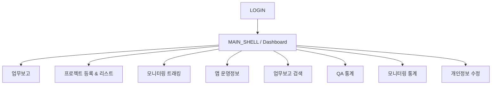

# 화면 설계서

## 1. 화면 분류 기준

이 시스템의 화면은 다음 3종류로 나뉩니다.

1. 로그인 전 독립 화면
2. 로그인 후 `index.php` 셸 내부의 주 메뉴 화면
3. 메뉴에 직접 노출되지 않는 숨김/관리 화면

## 2. 공통 화면 구조

### 2.1 로그인 전

| 화면 ID | 파일 | 목적 | 주요 요소 |
| --- | --- | --- | --- |
| `LOGIN` | `login/login.php` | 사용자 인증 | 아이디, 비밀번호, 로그인 버튼 |

### 2.2 로그인 후 공통 셸

| 화면 ID | 파일 | 목적 | 주요 요소 |
| --- | --- | --- | --- |
| `MAIN_SHELL` | `index.php` | 공통 레이아웃과 작업 영역 제공 | 상단 사용자 메뉴, 좌측 사이드바, `#page-wrapper` |

## 3. 주 메뉴 화면

### 3.1 Dashboard

| 항목 | 내용 |
| --- | --- |
| 화면 ID | `DASHBOARD` |
| 파일 | `pages/dashboard.php` |
| 진입 경로 | 로그인 직후 기본 랜딩, 메뉴 `Dashboard` |
| 목적 | 추천 모니터링 후보와 진행중 QA/모니터링 현황 요약 |
| 주요 컴포넌트 | 추천 모니터링 iOS 패널, 추천 모니터링 Android 패널, 진행중 모니터링 표, 진행중 QA 표 |
| 주요 데이터 소스 | `recommandmoni.php`, `month_moni_list.php`, `month_qa_list.php` |

### 3.2 업무보고

| 항목 | 내용 |
| --- | --- |
| 화면 ID | `REPORT` |
| 파일 | `pages/report.php` |
| 진입 경로 | 메뉴 `업무보고` |
| 목적 | 일일 업무 입력, 시간 확인, 업무 이력 조회/수정/삭제 |
| 주요 컴포넌트 | `기본 입력` 탭, `TYPE 입력` 탭, 오늘 입력시간, 미입력 시간, 업무 리스트 |
| 주요 특징 | 입력 폼이 타입/타입2/프로젝트 선택에 따라 동적으로 변함 |
| 주요 데이터 소스 | `type_type1.php`, `type_type2.php`, `report_pj_select.php`, `day_report_list.php`, `check_used_time.php`, `day_report_time_check.php` |

#### 업무보고 화면 상세

| 영역 | 설명 |
| --- | --- |
| 좌측 상단 | 업무 입력 폼 |
| 좌측 탭 1 | 기본 입력: 타입1, 타입2, 플랫폼, 프로젝트, 페이지/URL 등 |
| 좌측 탭 2 | TYPE 입력: 프로젝트 우선 선택 후 세부 업무 입력 |
| 우측 상단 | 오늘 누적 시간, 미입력/초과 시간 |
| 하단 | 본인 업무 리스트, 날짜 탐색, 기간 검색, 수정/삭제 |

### 3.3 프로젝트 등록 & 리스트

| 항목 | 내용 |
| --- | --- |
| 화면 ID | `PROJECT_LIST` |
| 파일 | `pages/project.php` |
| 진입 경로 | 메뉴 `프로젝트 관리 > 프로젝트 등록 & 리스트` |
| 목적 | 프로젝트 검색/등록/수정, 프로젝트 페이지 관리 |
| 주요 컴포넌트 | 프로젝트 리스트, 기간 필터, 검색어 필터, 신규 프로젝트 등록 레이어, 프로젝트 상세 수정 레이어, 페이지 목록/추가 폼 |
| 주요 데이터 소스 | `pj_select.php`, `pj_search.php`, `pj_add.php`, `pj_page.php`, `pj_page_select.php`, `pj_page_add.php`, `pj_page_edit.php`, `pj_page_del.php`, `pj_edit.php` |

#### 프로젝트 관리 UX 특징

- 모달 플러그인보다 `display` 토글과 반투명 배경(`#dim`)을 이용한 커스텀 오버레이를 사용합니다.
- 프로젝트 수정과 페이지 관리가 한 레이어에 결합되어 있습니다.
- 프로젝트 수정은 과거 업무 이력까지 영향을 줄 수 있습니다.

### 3.4 모니터링 트래킹

| 항목 | 내용 |
| --- | --- |
| 화면 ID | `TRACKING` |
| 파일 | `pages/track.php` |
| 진입 경로 | 메뉴 `프로젝트 관리 > 모니터링 트래킹` |
| 목적 | 페이지 단위 개선 상태/점검 이력/이슈 수 관리 |
| 주요 컴포넌트 | 상태 필터 버튼, 트래킹 테이블, 행 단위 인라인 수정 |
| 주요 데이터 소스 | `track_list.php`, `track_edit_select.php`, `track_edit_save.php` |

#### 트래킹 컬럼

- 플랫폼
- 프로젝트명
- 페이지&내용
- URL
- 아지트공유일 / 아지트URL
- 1차~4차 점검일
- 개선여부
- Highest / High / Normal 수정 수
- 비고

### 3.5 앱 운영정보

| 항목 | 내용 |
| --- | --- |
| 화면 ID | `APPINFO` |
| 파일 | `pages/appinfo.php` |
| 진입 경로 | 메뉴 `기타 > 앱 운영정보` |
| 목적 | 레거시 앱 운영 상태 조회/수정, 대시보드 추천 모니터링 보조 소스 관리 |
| 주요 컴포넌트 | 신규 앱 등록 폼, iOS 목록, Android 목록, 행 수정 |
| 주요 데이터 소스 | `list_appinfo.php`, `list_appinfo_add.php`, `list_appinfo_edit_select.php`, `list_appinfo_edit_save.php` |

해석 메모:

- 메뉴에서 직접 진입 가능하므로 완전 숨김 화면은 아닙니다.
- 다만 실제 업무 흐름의 중심 화면이라기보다 오래된 기준정보 관리 화면으로 보는 편이 더 자연스럽습니다.

### 3.6 업무보고 검색

| 항목 | 내용 |
| --- | --- |
| 화면 ID | `REPORT_SEARCH_PERSONAL` |
| 파일 | `pages/report_personal.php` |
| 진입 경로 | 메뉴 `기타 > 업무보고 검색` |
| 목적 | 본인 업무 이력 기간 조회 및 다운로드 |
| 주요 컴포넌트 | 어제/오늘 빠른 선택, 시작일/종료일, 검색, 다운로드, 결과 표 |
| 주요 데이터 소스 | `report_search.php`, `report_search_export.php` |

### 3.7 QA 통계

| 항목 | 내용 |
| --- | --- |
| 화면 ID | `STATI_QA` |
| 파일 | `pages/stati_qa.php` |
| 진입 경로 | 메뉴 `통계 > QA` |
| 목적 | 월별 QA 현황, 차트, 최근 기간 리스트 제공 |
| 주요 컴포넌트 | Google AreaChart, 통계 표, 최근 월별 QA 목록 |
| 주요 데이터 소스 | `track_info_qa.php` |

### 3.8 모니터링 통계

| 항목 | 내용 |
| --- | --- |
| 화면 ID | `STATI_MONI` |
| 파일 | `pages/stati_mo.php` |
| 진입 경로 | 메뉴 `통계 > 모니터링` |
| 목적 | 월별 모니터링 진행/개선 현황과 상세 리스트 제공 |
| 주요 컴포넌트 | Google AreaChart, 통계 표, 최근 월별 모니터링 목록 |
| 주요 데이터 소스 | `track_info_mo.php` |

### 3.9 개인정보 수정

| 항목 | 내용 |
| --- | --- |
| 화면 ID | `USERSET` |
| 파일 | `pages/userset.php` |
| 진입 경로 | 상단 사용자 메뉴 `개인정보 수정` |
| 목적 | 본인 비밀번호 변경 |
| 주요 컴포넌트 | 현재 ID/이름 표시, 현재 비밀번호, 새 비밀번호, 확인 비밀번호, 저장 버튼 |
| 주요 데이터 소스 | `updateuser.php` |

## 4. 숨김/관리 화면

| 화면 ID | 파일 | 목적 | 노출 상태 |
| --- | --- | --- | --- |
| `ALLREPORT` | `pages/allreport.php` | 전체 업무 이력 검색/다운로드 | 메뉴 미노출 |
| `TYPE_ADMIN` | `pages/type.php` | 업무 타입 기준정보 관리 | 메뉴 미노출 |
| `SERVICE_GROUP_ADMIN` | `pages/service_group.php` | 서비스 그룹 기준정보 관리 | 메뉴 미노출 |
| `MEMBER_ADMIN` | `pages/members.php` | 계정 목록/생성 | 메뉴 미노출 |
| `NEW_MEMBER` | `pages/new_member.php` | 구형 계정 생성 폼 | 메뉴 미노출 |
| `TEST_PAGE` | `pages/test.php` | 테스트 페이지 | 운영 화면 아님 |

## 5. 사용자 역할 관점 해석

### 5.1 코드상 명확한 사실

- 로그인은 `user_active = 1` 사용자만 허용합니다.
- 세션에는 `user_id`, `user_name`, `user_level`이 저장됩니다.
- 계정 생성은 `user_level = 1` 체크가 있습니다.

### 5.2 설계 문서상 해석

- 일반 사용자 주 화면: Dashboard, 업무보고, 프로젝트 조회/트래킹, 개인 검색, 통계
- 관리자성 화면: 계정관리, 타입 관리, 서비스 그룹 관리, 전체 검색, 일부 프로젝트 삭제
- 다만 화면 노출 제어가 완전하지 않아 "메뉴 미노출 = 접근 불가"는 아닙니다.

## 6. 화면 전환 시퀀스 요약

## 7. 설계 메모

- 화면 단위보다는 "표 + 인라인 수정 + 부분 갱신" 패턴이 반복됩니다.
- 업무보고는 단순 입력 화면이 아니라 가장 많은 연계 데이터를 조회하는 허브 화면입니다.
- 프로젝트 관리와 트래킹은 실질적으로 `PJ_TBL`, `PJ_PAGE_TBL` 운영 콘솔입니다.
- 통계 화면은 별도 집계 테이블 없이 운영 테이블을 직접 월별 집계합니다.
