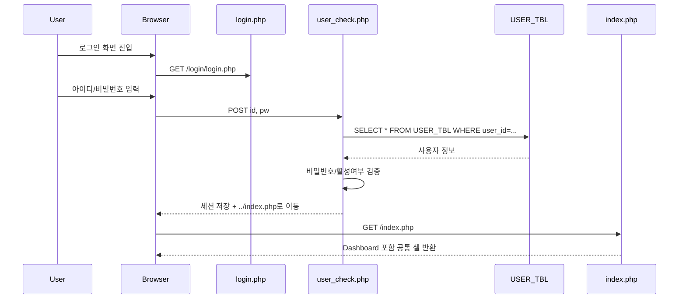
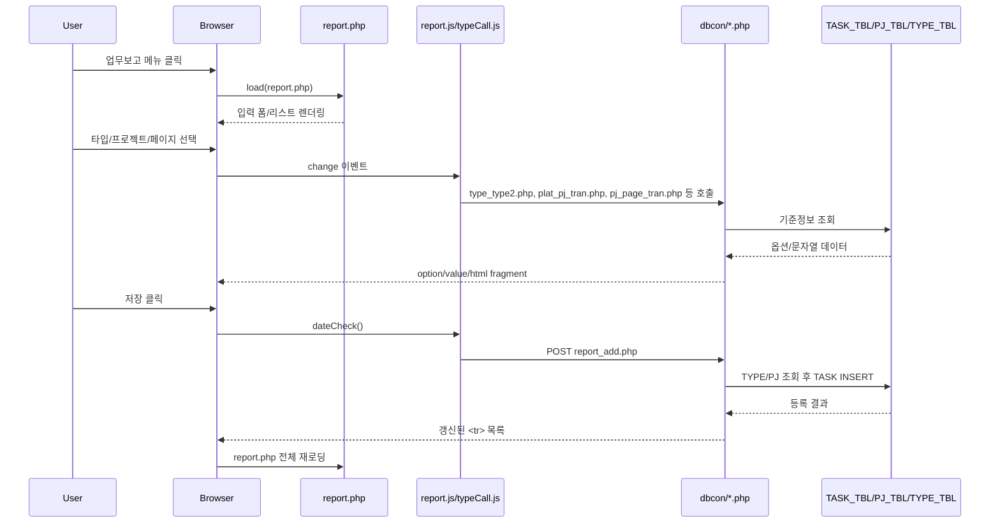
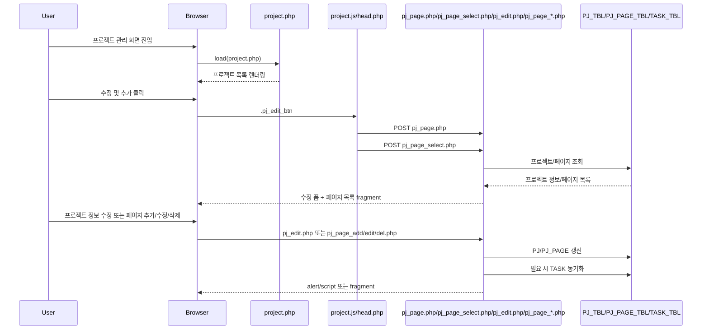
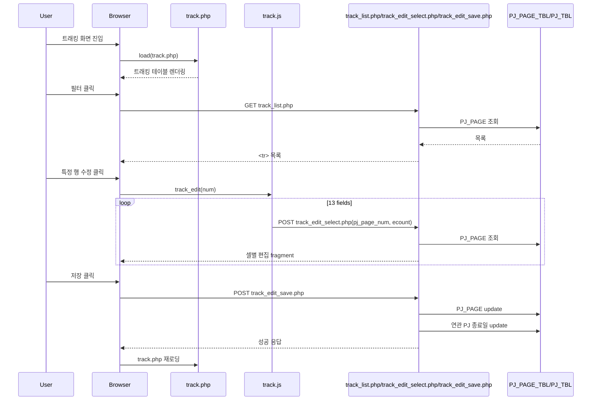
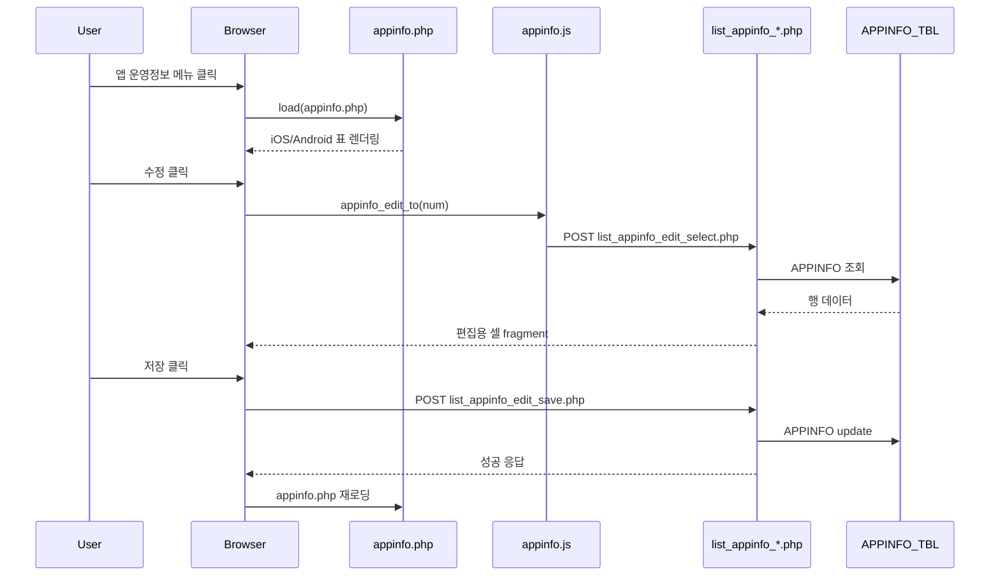

# 시퀀스 다이어그램

## 1. 로그인

```mermaid
sequenceDiagram
    participant U as User
    participant B as Browser
    participant L as login.php
    participant A as user_check.php
    participant DB as USER_TBL
    participant I as index.php

    U->>B: 로그인 화면 진입
    B->>L: GET /login/login.php
    U->>B: 아이디/비밀번호 입력
    B->>A: POST id, pw
    A->>DB: SELECT * FROM USER_TBL WHERE user_id=...
    DB-->>A: 사용자 정보
    A->>A: 비밀번호/활성여부 검증
    A-->>B: 세션 저장 + ../index.php로 이동
    B->>I: GET /index.php
    I-->>B: Dashboard 포함 공통 셸 반환
```

## 2. 업무보고 등록

```mermaid
sequenceDiagram
    participant U as User
    participant B as Browser
    participant R as report.php
    participant JS as report.js/typeCall.js
    participant API as dbcon/*.php
    participant DB as TASK_TBL/PJ_TBL/TYPE_TBL

    U->>B: 업무보고 메뉴 클릭
    B->>R: load(report.php)
    R-->>B: 입력 폼/리스트 렌더링
    U->>B: 타입/프로젝트/페이지 선택
    B->>JS: change 이벤트
    JS->>API: type_type2.php, plat_pj_tran.php, pj_page_tran.php 등 호출
    API->>DB: 기준정보 조회
    DB-->>API: 옵션/문자열 데이터
    API-->>B: option/value/html fragment
    U->>B: 저장 클릭
    B->>JS: dateCheck()
    JS->>API: POST report_add.php
    API->>DB: TYPE/PJ 조회 후 TASK INSERT
    DB-->>API: 등록 결과
    API-->>B: 갱신된 <tr> 목록
    B->>R: report.php 전체 재로딩
```

## 3. 프로젝트 수정과 페이지 관리

```mermaid
sequenceDiagram
    participant U as User
    participant B as Browser
    participant P as project.php
    participant JS as project.js/head.php
    participant API as pj_page.php/pj_page_select.php/pj_edit.php/pj_page_*.php
    participant DB as PJ_TBL/PJ_PAGE_TBL/TASK_TBL

    U->>B: 프로젝트 관리 화면 진입
    B->>P: load(project.php)
    P-->>B: 프로젝트 목록 렌더링
    U->>B: 수정 및 추가 클릭
    B->>JS: .pj_edit_btn
    JS->>API: POST pj_page.php
    JS->>API: POST pj_page_select.php
    API->>DB: 프로젝트/페이지 조회
    DB-->>API: 프로젝트 정보/페이지 목록
    API-->>B: 수정 폼 + 페이지 목록 fragment
    U->>B: 프로젝트 정보 수정 또는 페이지 추가/수정/삭제
    B->>API: pj_edit.php 또는 pj_page_add/edit/del.php
    API->>DB: PJ/PJ_PAGE 갱신
    API->>DB: 필요 시 TASK 동기화
    API-->>B: alert/script 또는 fragment
```

## 4. 트래킹 수정

```mermaid
sequenceDiagram
    participant U as User
    participant B as Browser
    participant T as track.php
    participant JS as track.js
    participant API as track_list.php/track_edit_select.php/track_edit_save.php
    participant DB as PJ_PAGE_TBL/PJ_TBL

    U->>B: 트래킹 화면 진입
    B->>T: load(track.php)
    T-->>B: 트래킹 테이블 렌더링
    U->>B: 필터 클릭
    B->>API: GET track_list.php
    API->>DB: PJ_PAGE 조회
    DB-->>API: 목록
    API-->>B: <tr> 목록
    U->>B: 특정 행 수정 클릭
    B->>JS: track_edit(num)
    loop 13 fields
        JS->>API: POST track_edit_select.php(pj_page_num, ecount)
        API->>DB: PJ_PAGE 조회
        API-->>B: 셀별 편집 fragment
    end
    U->>B: 저장 클릭
    B->>API: POST track_edit_save.php
    API->>DB: PJ_PAGE update
    API->>DB: 연관 PJ 종료일 update
    API-->>B: 성공 응답
    B->>T: track.php 재로딩
```

## 5. 앱 운영정보 수정

```mermaid
sequenceDiagram
    participant U as User
    participant B as Browser
    participant A as appinfo.php
    participant JS as appinfo.js
    participant API as list_appinfo_*.php
    participant DB as APPINFO_TBL

    U->>B: 앱 운영정보 메뉴 클릭
    B->>A: load(appinfo.php)
    A-->>B: iOS/Android 표 렌더링
    U->>B: 수정 클릭
    B->>JS: appinfo_edit_to(num)
    JS->>API: POST list_appinfo_edit_select.php
    API->>DB: APPINFO 조회
    DB-->>API: 행 데이터
    API-->>B: 편집용 셀 fragment
    U->>B: 저장 클릭
    B->>API: POST list_appinfo_edit_save.php
    API->>DB: APPINFO update
    API-->>B: 성공 응답
    B->>A: appinfo.php 재로딩
```
